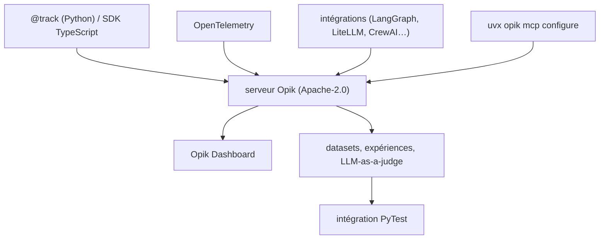

# comet-ml/opik

> Plateforme d'observabilité et d'évaluation LLM sous Apache-2.0, auto-hébergeable en entier.

## Le problème
Une application LLM échoue silencieusement : on ne voit ni l'arbre d'appels, ni le prompt exact,
ni la dérive de qualité entre deux versions — et les outils qui le montrent sont fermés.

## Ce que ça fait vraiment
Un décorateur `@track` enregistre toute fonction, appels imbriqués compris, donc les traces d'agents
complets. Des datasets et expériences pour l'évaluation, des métriques LLM-as-a-judge
(`Hallucination`, Answer Relevance, Context Precision), des règles d'évaluation en ligne sur les
traces de production, un playground de prompts, l'Opik Agent Optimizer, des garde-fous, et une
intégration PyTest pour évaluer en CI. Plus de soixante intégrations listées, plus OpenTelemetry.

## Comment c'est branché


## Essayer
```bash
pip install opik
opik configure
uvx opik mcp configure
git clone https://github.com/comet-ml/opik.git
cd opik
./opik.sh
```

## Coût et pièges
Auto-hébergé, c'est un Docker Compose complet (bases, caches) : `./opik.sh --infra`, `--backend`,
`--verify`, `--clean` (qui détruit tous les volumes). L'UI est sur `localhost:5173`. Les métriques
LLM-as-a-judge consomment un modèle, donc une clé et une facture. Le cloud Comet est l'option facile
mais sort les traces de ton infrastructure.

## Ce que ce n'est pas
Pas un simple SDK client : le dépôt contient le serveur et l'application web, et le README insiste
sur ce point face aux concurrents dont seul le SDK est ouvert. Pas un observateur d'infrastructure :
il trace des appels LLM, pas des conteneurs. Le tableau comparatif est écrit par l'éditeur.

## Alternatives
- Langfuse : cœur MIT auto-hébergeable, modules entreprise commerciaux (tableau du README).
- Phoenix (Arize) : source-available sous Elastic License 2.0, auto-hébergeable.
- LangSmith : auto-hébergement réservé à l'offre entreprise.

## Pour toi
Le choix par défaut si l'observabilité LLM doit rester chez toi — c'est le seul du tableau à l'être entièrement.
