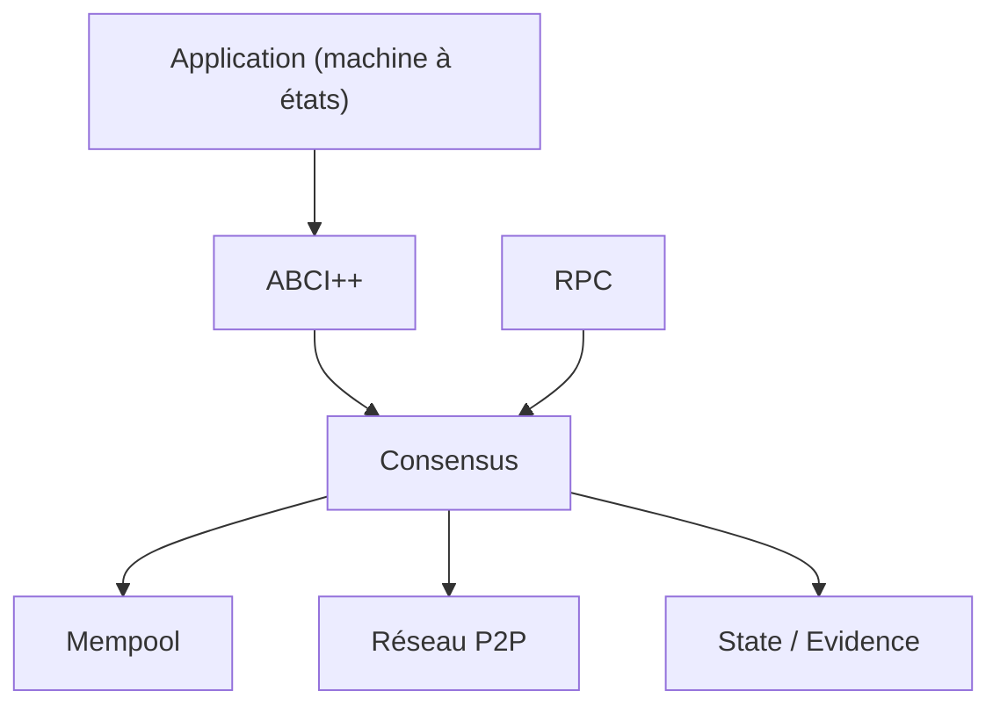

# cometbft/cometbft

> Moteur de consensus BFT (fork de Tendermint) qui réplique une machine à états sur plusieurs nœuds.

## Le problème
Faire tomber d'accord des machines qui ne se font pas confiance sur l'ordre des transactions, quel que soit le langage de l'application.

## Ce que ça fait vraiment
Middleware de consensus tolérant aux fautes byzantines : l'application, écrite dans n'importe quel langage, se branche via ABCI++. Le README annonce jusqu'à 10 000 TPS. Le schéma généré (sans composants lisibles) décrit consensus, mempool, P2P, state sync, pool d'évidence et RPC. Maintenu par Cosmos Labs.

## Comment c'est branché

## Essayer
Aucune commande dans le README ; il renvoie au guide d'installation et au démarrage d'un nœud unique ou d'un cluster docker-compose. Go 1.26.6+ requis sur `main`.

## Coût et pièges
Ne pas utiliser `main` en production. Un changement de version mineure peut casser la compatibilité avec une chaîne existante. 281 issues ouvertes.

## Ce que ce n'est pas
Ni une blockchain complète, ni un outil d'analyse de données : c'est la couche de consensus.

## Alternatives
Le README cite Tendermint Core (dont il est le fork) et les bibliothèques Cosmos SDK, IBC et Cosmos EVM en complément.

## Pour toi
À ignorer : infrastructure blockchain sans lien avec un travail data, IA ou MLOps.
