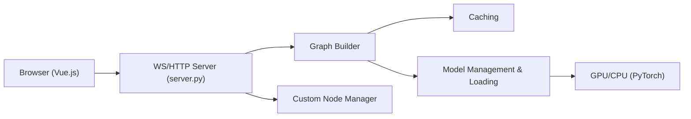

# comfyanonymous/ComfyUI

> Moteur de génération visuelle à graphe de nœuds pour images, vidéo, audio et 3D, en local ou dans le cloud.

## Le problème
Enchaîner modèles de diffusion, ControlNet, LoRA et upscalers demande un outil visuel réutilisable et reproductible.

## Ce que ça fait vraiment
Interface à graphe de nœuds avec serveur Python, exécution asynchrone en file, ré-exécution partielle du graphe (seules les parties modifiées) et gestion de VRAM avec déchargement. Prend en charge de nombreux modèles (SD, SDXL, Flux, Wan, LTX, HunyuanVideo, etc.). Workflows en JSON, extensions par nœuds personnalisés, gestionnaire optionnel ComfyUI-Manager. GPU NVIDIA, AMD, Intel, Apple, Ascend.

## Comment c'est branché


## Essayer
```bash
pip install comfy-cli
comfy install
pip install -r requirements.txt
python main.py
```

## Coût et pièges
Gratuit en local ; modèles de plusieurs Go à télécharger et GPU conseillé. Les nœuds API partenaires sont payants (désactivables avec `--disable-api-nodes`), Comfy Cloud est payant. Les commits hors versions stables peuvent casser des nœuds personnalisés. Les faits du catalogue sont manquants ici.

## Ce que ce n'est pas
Pas un service géré : tu gères modèles, dépendances et mises à jour. Le README ne précise pas sa licence.

## Alternatives
Aucune alternative nommée dans le README.

## Pour toi
Adopter si tu fais de l'IA générative visuelle : c'est la référence par sa couverture de modèles ; vérifier la licence dans le dépôt avant un usage commercial.
