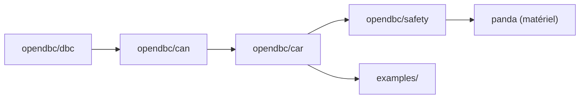

# commaai/opendbc

> API Python pour lire et piloter direction, gaz et freins des voitures, pour développeurs d'openpilot.

## Le problème
Chaque marque encode ses messages CAN différemment, et piloter une voiture exige une couche de sécurité fiable.

## Ce que ça fait vraiment
Elle décrit les messages CAN dans des fichiers DBC, les lit et les écrit via une bibliothèque CAN, puis expose des interfaces par marque (`carstate`, `carcontroller`, `fingerprints`). Un firmware de sécurité en C, testé avec MISRA et 100 % de couverture, contrôle ce qui peut être émis. Des primes récompensent les ports de voitures.

## Comment c'est branché


## Essayer
```bash
git clone https://github.com/commaai/opendbc.git
cd opendbc
./test.sh
pip3 install -e .[testing]
scons -j8
```

## Coût et pièges
Le code est gratuit. Piloter une vraie voiture demande un comma four et un harnais, vendus par comma. Compilation avec scons.

## Ce que ce n'est pas
Pas une appli grand public : c'est une brique de bas niveau. La liste des voitures prises en charge est dans un document à part.

## Alternatives
Aucune alternative nommée dans le README.

## Pour toi
À surveiller si tu touches à la donnée véhicule ou à la robotique : les DBC et la base commaCarSegments servent aussi hors conduite.

