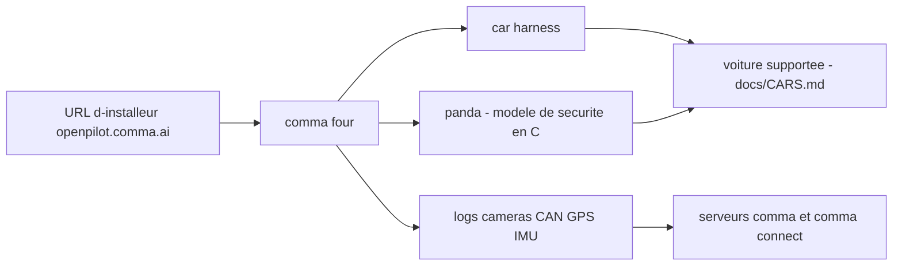

# commaai/openpilot

> **Embedded software replacing the driver assistance of 300+ cars, for equipped tinkerers.**

## The problem

Without it, a car's driver assistance stays the one the manufacturer shipped: closed, not
modifiable, not observable. No way to plug in your own code or models, and no way to replay
drives to understand what the system decided.

## What it actually does

The README calls it "an operating system for robotics", and states that its current concrete
use is upgrading driver assistance on the 300+ cars listed in `docs/CARS.md`. It is installed
on a comma four device through an installer URL, connects to the car bus through a harness,
and logs road-facing cameras, CAN, GPS, IMU, magnetometer, thermal sensors, crashes and OS
logs. The safety model itself is not in this repository: it lives in panda, written in C.
The README does not document the internal process architecture.

## How it is wired



The README describes a hardware chain before a software one: you pick a branch
(`release-mici`, `nightly`, chestnut variants...), enter the matching URL in the device setup
procedure, and the harness links the device to the car bus. panda is named as the component
carrying the safety code. Data flows by default to comma's servers, viewable through comma
connect.

## Trying it

```bash
bash <(curl -fsSL openpilot.comma.ai)
```

That is the README's "Quick start". For in-car use no command is documented: you enter an
installer URL (`openpilot.comma.ai`, `openpilot-nightly.comma.ai`,
`installer.comma.ai/commaai/nightly-dev`...) in the device setup.

## Cost and traps

The code is MIT, but real use means buying a comma four and a car harness from the comma
shop, and owning a car from the 300+ supported list. The README notes other hardware can run
it but is not plug-and-play. Driving data is uploaded to comma's servers by default;
collection can be disabled, and the driver-facing camera and microphone are logged only on
explicit opt-in. The license carries a clause where the user indemnifies Comma.ai, and
accepting grants comma an irrevocable, perpetual, worldwide right over the data produced.

## What it is not

Not turnkey self-driving: the README states in capitals that this is alpha quality software
for research purposes only, with no warranty, and that complying with local laws is the
user's responsibility. Not a package you install on a laptop to experiment either: without
device, harness and a supported car there is nothing to run. And the safety model is not
here, it is in panda.

## Alternatives

The README names no competing project; it only cites panda, part of the same ecosystem.
Among the supplied neighbours, neither autonomous-ai/autonomous-os nor weaviate/weaviate
deals with embedded driver assistance: no comparable alternative in the catalogue.

## For you

Limited interest for everyday data tooling, but it is one of the few open source real-time
systems with a full sensors to model to actuator loop and explicitly described
software- and hardware-in-the-loop testing (ISO 26262, Jenkins suite, a closet of 10 devices
continuously replaying routes). Worth watching as an embedded MLOps reference rather than
adopting, unless you want to contribute — comma hires and pays bounties.
