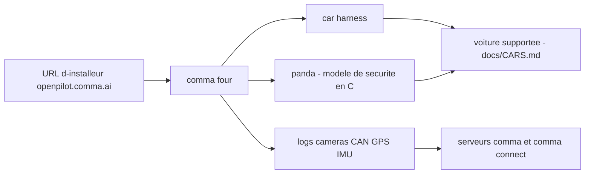

# commaai/openpilot

> **Logiciel embarqué qui remplace l'aide à la conduite de 300+ voitures, pour bricoleurs équipés.**

## Le problème

Sans lui, l'aide à la conduite d'une voiture reste celle que le constructeur a livrée : fermée,
non modifiable, non observable. Aucun moyen d'y brancher son propre code, ses propres modèles,
ni de rejouer les trajets pour comprendre ce que le système a décidé.

## Ce que ça fait vraiment

Le README se présente comme « un système d'exploitation pour la robotique », et précise
qu'aujourd'hui son usage concret est la mise à niveau de l'aide à la conduite sur plus de
300 voitures listées dans `docs/CARS.md`. Le logiciel s'installe sur un appareil comma four
via une URL d'installeur, se branche au bus de la voiture par un faisceau, et enregistre
caméras route, CAN, GPS, IMU, magnétomètre, capteurs thermiques, crashs et logs système.
Le modèle de sécurité proprement dit n'est pas dans ce dépôt : il vit dans panda, en C.
Le README ne documente pas l'architecture interne des processus.

## Comment c'est branché



Le README décrit une chaîne matérielle avant d'être logicielle : on choisit une branche
(`release-mici`, `nightly`, variantes chestnut…), on saisit l'URL correspondante dans la
procédure de configuration de l'appareil, et le faisceau relie l'appareil au bus de la
voiture. panda est cité comme le composant qui porte le code de sécurité. Les données
remontent par défaut vers les serveurs de comma et sont consultables via comma connect.

## Essayer

```bash
bash <(curl -fsSL openpilot.comma.ai)
```

C'est le « Quick start » du README. Pour l'usage en voiture, aucune commande n'est
documentée : on saisit une URL d'installeur (`openpilot.comma.ai`,
`openpilot-nightly.comma.ai`, `installer.comma.ai/commaai/nightly-dev`…) dans la
configuration de l'appareil.

## Coût et pièges

Le code est sous MIT, mais l'usage réel suppose d'acheter un comma four et un car harness
sur la boutique comma, et de posséder une voiture figurant dans la liste des 300+ modèles.
Le README signale qu'on peut le faire tourner sur d'autres matériels, mais que ce n'est pas
plug-and-play. Par défaut, les données de conduite sont envoyées aux serveurs de comma ;
la collecte peut être désactivée, la caméra conducteur et le micro ne sont enregistrés
qu'après opt-in explicite. La licence s'accompagne d'une clause d'indemnisation de Comma.ai
par l'utilisateur, et l'acceptation cède à comma un droit irrévocable et perpétuel sur les
données produites.

## Ce que ce n'est pas

Ce n'est pas une conduite autonome livrée clés en main : le README écrit en majuscules qu'il
s'agit d'un logiciel de qualité alpha à visée de recherche, sans garantie, et que la
conformité aux lois locales incombe à l'utilisateur. Ce n'est pas non plus un paquet qu'on
installe sur son poste pour expérimenter : sans appareil, faisceau et voiture compatible, il
n'y a rien à exécuter. Et le modèle de sécurité n'est pas ici, il est dans panda.

## Alternatives

Le README ne nomme aucun projet concurrent ; il ne cite que panda, composant du même
écosystème. Parmi les voisins fournis, ni autonomous-ai/autonomous-os ni weaviate/weaviate
ne traitent d'aide à la conduite embarquée : aucune alternative comparable dans le catalogue.

## Pour toi

Intérêt limité côté outillage data quotidien, mais c'est un des rares systèmes temps réel
open source avec boucle complète capteurs → modèle → actionneur et tests logiciels et
matériels dans la boucle décrits explicitement (ISO 26262, suite Jenkins, placard de
10 appareils rejouant des trajets en continu). À regarder comme référence de MLOps embarqué
plutôt qu'à adopter, sauf à vouloir y contribuer — comma recrute et paie des bounties.
