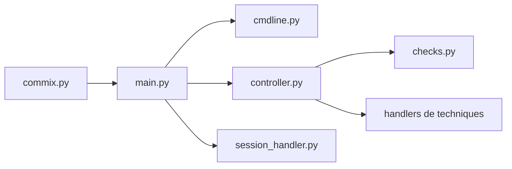

# commixproject/commix

> Outil Python de test d'intrusion qui détecte les injections de commandes et de code, pour audits autorisés.

## Le problème
Les failles d'injection de commandes dans des applications web sont fastidieuses à détecter à la main sur de nombreux paramètres et cibles.

## Ce que ça fait vraiment
Commix analyse des cibles (URL, formulaires, crawl, sitemap, fichier de requêtes, stdin) et teste si des paramètres, en-têtes, cookies ou corps JSON/XML sont vulnérables, selon quatre techniques : résultat direct, temporelle, par fichier et hors bande (OAST). Il propose aussi une détection d'injection de code (PHP, Python), des modules dédiés, des filtres de contournement (tampers), l'énumération et l'accès aux fichiers de la cible, ainsi que des sessions reprenables et un export JSON.

## Comment c'est branché


## Essayer
```bash
git clone https://github.com/commixproject/commix.git commix
python3 commix.py -h
```
Python 3.7 ou plus ; les dépendances sont incluses. Les exemples d'exploitation du README ne sont pas repris ici.

## Coût et pièges
Gratuit. Le projet est en développement actif avec ruptures possibles entre révisions. Le README déconseille de l'exécuter comme service et de l'utiliser hors systèmes que l'on possède ou est explicitement autorisé à tester. La détection OAST passe par le serveur public `oast.fun` par défaut : des métadonnées de la cible sortent du réseau, sauf serveur auto-hébergé.

## Ce que ce n'est pas
Ce n'est pas un scanner généraliste de vulnérabilités : il ne cible que l'injection de commandes et de code. La licence n'est pas identifiée par GitHub : à vérifier avant tout usage dans un cadre professionnel.

## Alternatives
Aucune alternative nommée dans le README.

## Pour toi
Surveiller : outil de pentest web sans rapport direct avec data/IA/MLOps ; à ne garder en tête que pour un audit mandaté d'une application exposant un modèle ou une API.

