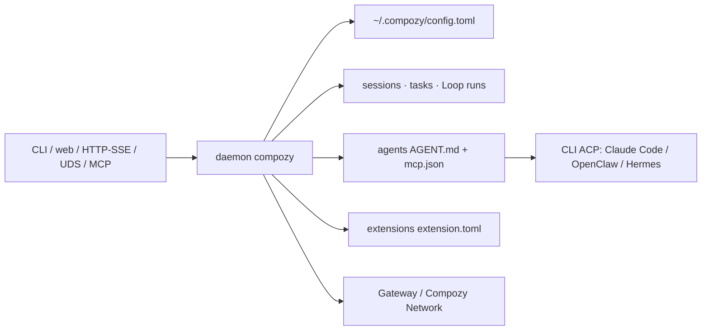

# compozy/compozy

> Démon local qui fait tourner, planifie et supervise des agents en continu, pour développeurs et opérateurs.

## Le problème
Prompter un agent est facile ; le faire tourner en continu reste un projet d'ingénierie :
boucles, triggers, cron, mémoire, permissions, approbations, observabilité et scripts de colle.
Fermer le terminal tue le travail en cours.

## Ce que ça fait vraiment
Sessions, agents, Loops et capacités sont des objets qu'on écrit une fois et qu'on réutilise.
Planification cron, webhooks et triggers font tourner le travail sans terminal ouvert.
Approbations, permissions, état des runs, artefacts et activité des agents restent inspectables
pendant l'exécution. Le démon possède l'état, donc fermer un client n'efface rien.
Pilote les CLI compatibles ACP : Claude Code, OpenClaw, Hermes. Un binaire Go et des stores SQLite,
local par défaut ; la Gateway n'expose que les surfaces activées explicitement.
Extensible par agents, skills, capacités, hooks, bridges et kits d'extension. Compozy Network permet
à des sessions de découvrir des pairs, échanger des messages typés et déléguer avec reçus.

## Comment c'est branché


## Essayer
```bash
curl -fsSL https://compozy.com/install.sh | sh
npm install -g @compozy/cli@beta
compozy install && compozy daemon start
compozy session new --agent general --name first-run
compozy extension init hello --template tool-provider-go
compozy doctor -o json
make dev && make gate
```

## Coût et pièges
Gratuit côté outil, mais les agents qu'il pilote consomment tes abonnements ou tes clés.
La ligne v0.3 est en bêta : v0.2.15 est dépréciée, maintenue seulement pour des correctifs critiques
sur `legacy/v0.2`, et une migration est obligatoire. `go install @latest` résout encore la v0.2 :
il faut le tag explicite. Homebrew est volontairement absent pendant la bêta.

## Ce que ce n'est pas
Ce n'est pas un agent : il n'apporte aucun modèle, il orchestre des CLI que tu as déjà.
Ce n'est pas compatible avec l'état v0.2 : le pipeline `tasks run` n'existe plus, les fichiers de
mémoire v0.2 restent de simples artefacts de dépôt. Ce n'est pas un service hébergé.

## Alternatives
Aucune nommée ; seules les CLI ACP pilotées (Claude Code, OpenClaw, Hermes) sont citées.

## Pour toi
L'idée juste — un démon qui possède l'état des agents — mais c'est une bêta : à revoir en v0.3 stable.
