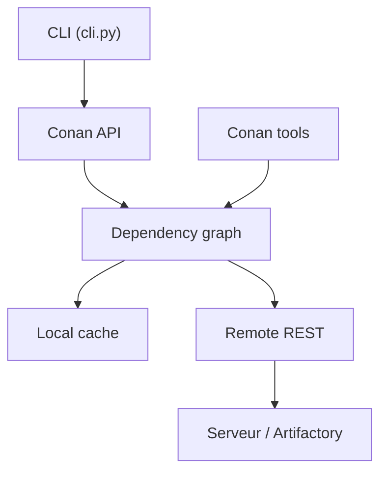

# conan-io/conan

> Gestionnaire de paquets décentralisé pour C et C++, à l'usage des développeurs qui gèrent dépendances et binaires.

## Le problème
En C/C++, gérer les dépendances et leurs binaires selon la plateforme, le compilateur et les options est une source d'erreurs récurrente.

## Ce que ça fait vraiment
Le client Python résout un graphe de dépendances décrit par des recettes `conanfile.py`, cherche les binaires dans un cache local puis sur des dépôts distants (Artifactory ou compatible), construit ce qui manque et peut téléverser les paquets. Les outils de `conan/tools` génèrent des fichiers pour CMake, Meson, MSBuild, Bazel, etc. Un serveur Conan hérité existe dans `conans/server`. Le README présenté ici est celui du mainteneur.

## Comment c'est branché


## Essayer
```bash
git clone https://github.com/conan-io/conan.git conan-io
cd conan-io && pip install -e .
conan --help
python -m pip install -r conans/requirements.txt
python -m pytest .
```

## Coût et pièges
Gratuit. Le nom du dossier de clonage compte pour les tests (`conan-io` conseillé). Les tests Artifactory demandent un serveur dédié, car ils créent des dépôts.

## Ce que ce n'est pas
Ce n'est pas un système de build : il gère les paquets et génère des fichiers pour les systèmes de build existants.

## Alternatives
Aucune alternative nommée dans le README.

## Pour toi
À surveiller : utile seulement si tu compiles des extensions C/C++ ou des runtimes d'inférence ; sinon pip ou conda couvrent ton besoin.

