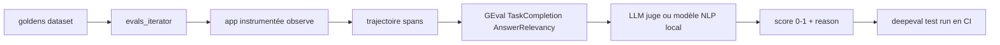

# confident-ai/deepeval

> Cadre d'évaluation de systèmes LLM, construit comme pytest mais pour agents, RAG et chatbots.

## Le problème
Savoir si un changement de prompt ou de modèle améliore ton application relève souvent du ressenti.
Sans métrique reproductible, tu ne peux ni comparer deux versions ni détecter une régression.

## Ce que ça fait vraiment
Un catalogue de métriques avec explications : G-Eval, DAG, métriques agentiques, RAG, multi-tours, MCP, multimodal.
Les métriques s'exécutent avec le LLM de ton choix, des méthodes statistiques ou des modèles NLP locaux.
`deepeval test run test_chatbot.py` s'intègre à pytest et à n'importe quelle CI ; `evaluate()` marche hors pytest.
`evals_iterator()` et `@observe()` tracent la trajectoire complète pour évaluer chaque étape d'un agent.

## Comment c'est branché


## Essayer
```bash
pip install -U deepeval
export OPENAI_API_KEY="..."
touch test_chatbot.py
deepeval test run test_chatbot.py
```
Les intégrations (LangChain, LangGraph, CrewAI, Pydantic AI, OpenAI Agents, LlamaIndex, Google ADK, Strands)
se branchent par un `CallbackHandler` ou un `instrument_*()`.

## Coût et pièges
Les métriques LLM-as-a-judge consomment des jetons à chaque exécution : une suite complète se facture.
DeepEval charge `.env.local` puis `.env` du dossier courant à l'import ; `DEEPEVAL_DISABLE_DOTENV=1` pour s'y soustraire.

## Ce que ce n'est pas
Pas neutre vis-à-vis de sa plateforme : `deepeval login` pousse les cas de test vers Confident AI, c'est un choix à faire.
Pas entièrement local : seules certaines métriques tournent sur ta machine, les autres appellent un modèle juge.
Pas une garantie de qualité : un juge LLM a lui aussi un taux d'erreur, à calibrer sur des cas connus.

## Alternatives
`Pydantic Evals` — cité dans l'écosystème Pydantic AI pour le même besoin en Python typé.
`RAGAS` — présent ici comme métrique agrégée plutôt que comme cadre concurrent.

## Pour toi
Le chaînon manquant entre ton pipeline RAG et une CI : commence par une métrique, pas par le catalogue entier.
