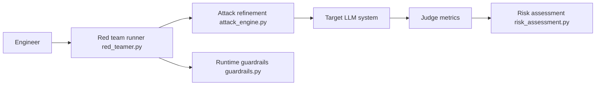

# confident-ai/deepteam

> Framework Python qui teste la robustesse et la sécurité de ses propres applications LLM, avec garde-fous.

## Le problème
Un agent, un pipeline RAG ou un chatbot peut fuiter des données, se laisser détourner ou produire du contenu problématique, et on le découvre en production.

## Ce que ça fait vraiment
On enveloppe son application dans un `model_callback`. DeepTeam génère des scénarios de test à partir de vulnérabilités choisies (biais, fuite de données personnelles, autorisations, dérive d'agent, plus de 50) et d'attaques simples ou multi-tours, puis note les réponses avec des métriques LLM-juge (score binaire avec justification), localement. Il peut se caler sur OWASP, NIST, MITRE ATLAS, et propose 7 garde-fous d'entrée/sortie. Usage CLI (YAML) ou Python.

## Comment c'est branché


## Essayer
```bash
pip install -U deepteam
python red_team_llm.py
```
Le script `red_team_llm.py` utilise `red_team(model_callback=..., vulnerabilities=[Bias(types=["race"])], attacks=[PromptInjection()])` ; `OPENAI_API_KEY` doit être défini (ou un autre modèle supporté par DeepEval).

## Coût et pièges
Les attaques et les juges sont générés par un LLM : appels facturés à ta charge (clé OpenAI par défaut). Le volume d'appels croît avec le nombre de vulnérabilités et d'attaques choisies. La plateforme Confident AI est optionnelle, en SaaS.

## Ce que ce n'est pas
Un outil à n'utiliser que sur des systèmes dont on est propriétaire ou pour lesquels on a une autorisation explicite de test. Il ne remplace ni un audit de sécurité humain ni une garantie de conformité : les scores dépendent du modèle juge.

## Alternatives
- DeepEval : framework d'évaluation LLM sur lequel DeepTeam est construit.

## Pour toi
À adopter : il s'intègre à un cycle d'évaluation LLM/MLOps, tourne en local sous Apache-2.0 et couvre les référentiels OWASP/NIST, à condition de budgéter les appels d'API.
