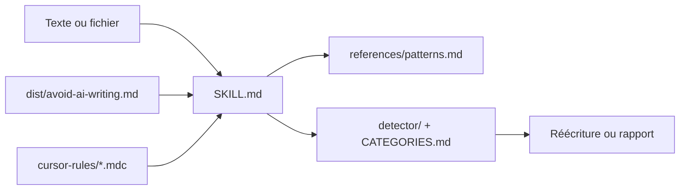

# conorbronsdon/avoid-ai-writing

> Skill portable qui repère et réécrit les tics d'écriture des LLM dans un texte.

## Le problème
Les textes produits par un LLM se reconnaissent : « leverage », « seamless », conclusions creuses.
Un prompt « rends ça humain » attrape l'évident et laisse passer le reste.

## Ce que ça fait vraiment
Trois modes : réécriture (défaut), détection seule, et édition en place d'un fichier de prose.
Une table de 112 remplacements sur trois paliers, plus 74 catégories de motifs documentées.
Le plafond de passes d'édition se règle avec `--iterate 1|2` ; le skill rend compte des passes utilisées.
Un profil de voix (casual, professional, technical, warm, blunt) oriente le ton indépendamment du contexte.

## Comment c'est branché


## Essayer
```bash
git clone https://github.com/conorbronsdon/avoid-ai-writing ~/.claude/skills/avoid-ai-writing
```

## Coût et pièges
Rien à payer, rien à installer au-delà d'un clone ; le coût réel est en tokens de l'agent qui l'exécute.
Garder `SKILL.md` avec `references/patterns.md` : le fichier d'entrée seul ne suffit pas.

## Ce que ce n'est pas
Pas un détecteur fiable d'origine : plusieurs motifs sont explicitement des jugements, pas des règles.
Pas fait pour du code ou de la configuration — le mode édition les refuse.
Pas un correcteur de fond : il touche le style, pas l'exactitude.

## Alternatives
Aucune alternative nommée dans le README.

## Pour toi
Utile si tu publies des notes de veille lisibles ; à tester sur un texte avant d'en faire une habitude.
