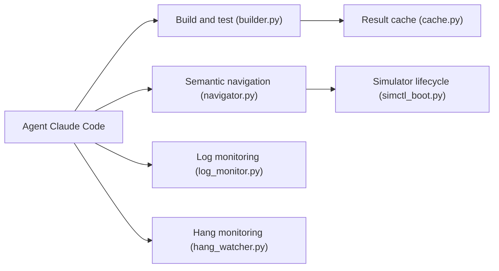

# conorluddy/ios-simulator-skill

> Skill Claude Code de 29 scripts pour compiler, tester et piloter le simulateur iOS.

## Le problème
Les sorties brutes de `xcodebuild` et du simulateur consomment beaucoup de tokens et les taps par coordonnées sont fragiles.

## Ce que ça fait vraiment
Scripts Python qui enveloppent `xcodebuild`, `xcrun simctl` et `idb`. Le build renvoie une ligne de résumé avec un identifiant xcresult, détaillé à la demande ; la navigation passe par l'arbre d'accessibilité plutôt que des coordonnées. Ajoute audits d'accessibilité et de localisation, diff visuel, logs, suivi de « hangs » (HangBuster), capture d'état d'app. Tous les plafonds se règlent via `IOS_SIM_*`.

## Comment c'est branché


## Essayer
```bash
/plugin marketplace add conorluddy/ios-simulator-skill
/plugin install ios-simulator-skill@conorluddy
bash scripts/sim_health_check.sh
```

## Coût et pièges
Gratuit. Exige macOS 15+, Xcode 26+, Python 3.12+ et `idb` 1.5.1+ (Homebrew, tap Meta) ; sous Xcode 27, un `idb-companion` ancien ignore silencieusement taps et frappes.

## Ce que ce n'est pas
Ne fonctionne que sur Mac avec Xcode. Les chiffres d'éval (100 % contre 46 %, 3 cas) sont un très petit échantillon.

## Alternatives
XC-MCP (version MCP sur NPM) et xclaude-plugin (outillage Xcode seul).

## Pour toi
À ignorer : utile uniquement pour du développement iOS, hors du périmètre data/IA/MLOps ; intéressant seulement comme exemple de skill économe en tokens.

