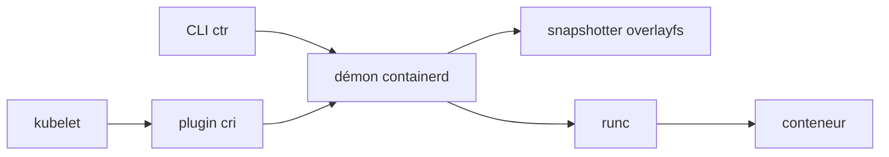

# containerd/containerd

> Démon qui gère le cycle de vie des conteneurs d'une machine, destiné à être embarqué.

## Le problème
Faire tourner des conteneurs demande de coordonner images, stockage, réseau et supervision.
Écrire cette plomberie soi-même, ou dépendre d'un moteur complet, coûte cher.

## Ce que ça fait vraiment
Transfert et stockage d'images, exécution et supervision de conteneurs, attachement stockage et réseau.
Démon disponible sur Linux et Windows ; le travail bas niveau passe par `runc` (Linux) ou hcsshim (Windows).
Le plugin `cri` est intégré aux binaires de release depuis la 1.1 et activé par défaut : c'est ce que Kubernetes appelle.
Le snapshotter par défaut est overlayfs ; btrfs est une alternative documentée.

## Comment c'est branché


## Essayer
```bash
source ./contrib/autocomplete/ctr
```
Le README ne documente aucune commande d'installation : il renvoie à containerd.io, à la page des
releases, aux builds nocturnes et à `BUILDING` pour la compilation.

## Coût et pièges
Noyau Linux 4.x minimum pour overlayfs, 3.18 pour btrfs (avec module et outils btrfs installés).
`criu` est requis pour checkpoint/restore ; la version de `runc` exigée est fixée dans `RUNC.md`.

## Ce que ce n'est pas
Pas un outil destiné aux développeurs ou aux utilisateurs finaux : il est conçu pour être embarqué.
Pas un remplaçant de Docker côté expérience : `ctr` est un client de service, pas une CLI de travail.
Les builds nocturnes sont explicitement déconseillés en production, sans support.

## Alternatives
`runc` — c'est la couche en dessous, pas un concurrent : containerd l'appelle.
`cri-tools` / `critest` — pour valider une implémentation CRI plutôt que l'exécuter.

## Pour toi
Tu l'utilises déjà sans le savoir sous Kubernetes : à connaître pour débugger, pas à installer.
