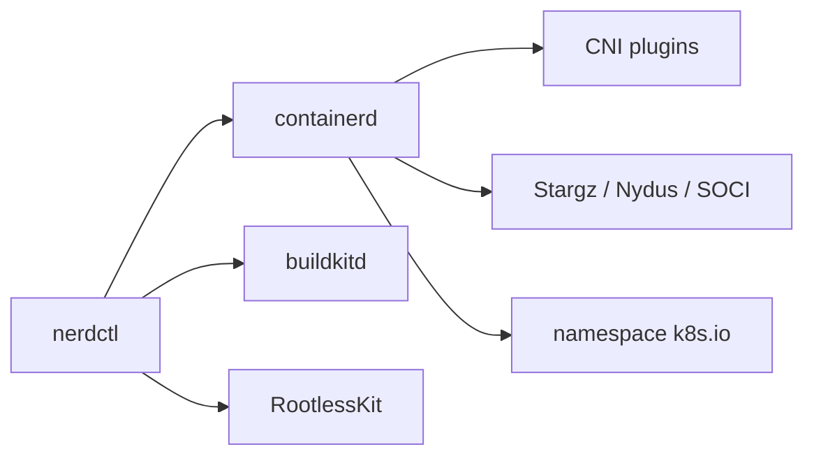

# containerd/nerdctl

> CLI compatible Docker pour containerd, ouvrant les fonctions absentes de Docker.

## Le problème
containerd seul s'utilise avec `ctr` ou `crictl`, incompatibles avec la CLI Docker et hostiles :
ni `run -p`, ni `logs`, ni `build`, ni `compose`.

## Ce que ça fait vraiment
Reproduit l'ergonomie de `docker` (`run`, `build`, `compose up`, `logs`, `load`, `save`) sur containerd,
et ajoute le lazy-pulling (Stargz, Nydus, OverlayBD, SOCI), le chiffrement d'images via ocicrypt,
la distribution P2P par IPFS, la vérification cosign, le mode rootless accéléré par bypass4netns et
le namespacing (`--namespace k8s.io` pour déboguer un cluster). Sous-projet **non-core** de containerd, Apache 2.0.

## Comment c'est branché


## Essayer
```bash
nerdctl run -it --rm alpine
nerdctl build -t foo /some-dockerfile-directory
nerdctl compose -f ./examples/compose-wordpress/docker-compose.yaml up
nerdctl --namespace k8s.io ps -a
brew install nerdctl
```

## Coût et pièges
Gratuit. Il faut containerd plus les plugins CNI ; BuildKit pour `build`, RootlessKit pour le rootless.
L'archive `nerdctl-full` les embarque, pas l'archive simple. macOS passe par Lima ; Windows par Scoop,
conteneurs Windows expérimentaux. IPFS est strictement opt-in.

## Ce que ce n'est pas
Pas un concurrent de Docker : le projet le dit, le but est d'exposer les fonctions avancées de containerd
en attendant que Docker les reprenne. Pas un daemon supplémentaire non plus.

## Alternatives
- **ctr** : livré avec containerd, mais incompatible Docker et sans `run -p`, `logs`, `build`, `compose`.
- **crictl** : orienté CRI, ne couvre pas les fonctions hors CRI.
- **Rancher Kim** : exige Kubernetes, limité à la gestion d'images.

## Pour toi
Le bon outil pour inspecter et rebâtir des images directement sur un nœud Kubernetes.
