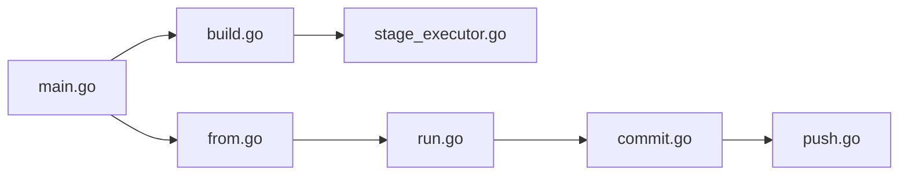

# containers/buildah

> Outil en ligne de commande pour construire des images OCI, avec ou sans Dockerfile, sans démon.

## Le problème
Construire une image via le démon Docker suppose des droits root et n'offre qu'un format de script figé.

## Ce que ça fait vraiment
Crée un conteneur de travail (`buildah from`), y copie ou exécute des commandes, monte son système de fichiers, puis valide en image (`commit`). Construit aussi depuis un Containerfile (`buildah build`). Formats OCI et Docker. Modèle fork-exec, sans démon ni root obligatoire, avec une API Go réutilisable (Podman l'emploie pour les builds).

## Comment c'est branché


## Essayer
```bash
ctr1=$(buildah from "${1:-fedora}")
buildah config --cmd "/usr/sbin/lighttpd -D -f /etc/lighttpd/lighttpd.conf" "$ctr1"
buildah config --port 80 "$ctr1"
buildah commit "$ctr1" "${2:-$USER/lighttpd}"
```

## Coût et pièges
Gratuit. Les conteneurs Buildah ne sont pas visibles depuis Podman, et inversement (stockages différents).

## Ce que ce n'est pas
Ce n'est pas un outil d'exécution longue durée : pour gérer et lancer des conteneurs, le README pointe vers Podman.

## Alternatives
- Podman : gère, lance et maintient les conteneurs ; s'appuie sur Buildah pour les builds.

## Pour toi
Adopter pour des builds d'images reproductibles en CI sans démon : Apache-2.0, très actif.

