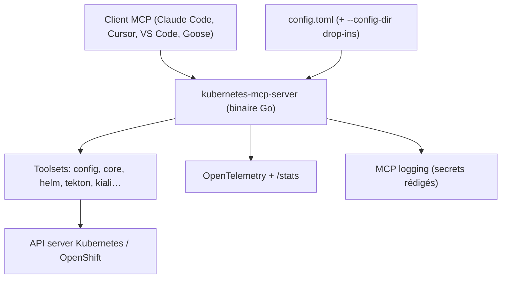

# containers/kubernetes-mcp-server

> Serveur MCP Go qui parle directement à l'API Kubernetes, sans passer par kubectl.

## Le problème
Les serveurs MCP Kubernetes existants enveloppent `kubectl` : il faut installer la chaîne
d'outils, subir la latence des processus externes et se contenter de ce que la CLI expose.

## Ce que ça fait vraiment
Implémentation Go native qui dialogue avec l'API server : CRUD générique sur n'importe quelle
ressource Kubernetes ou OpenShift, opérations dédiées sur les pods (list, get, delete, logs,
top, exec, run), namespaces, events, projets OpenShift, logs et statistiques de nœuds. Les
outils sont regroupés en *toolsets* activables (`config` et `core` par défaut ; `helm`, `kcp`,
`kiali`, `kubevirt`, `netobserv`, `tekton` en option) pour réduire le contexte et améliorer la
sélection d'outils par le LLM. Configuration en TOML avec fichiers drop-in, rechargement
dynamique par SIGHUP, ressources interdites, prompts MCP personnalisés et OAuth/OIDC en mode
HTTP. Journalisation MCP avec rédaction automatique des jetons et mots de passe.

## Comment c'est branché


## Essayer
```bash
npx kubernetes-mcp-server@latest --help
uvx kubernetes-mcp-server@latest --help
./kubernetes-mcp-server --help
kubernetes-mcp-server --config /etc/kubernetes-mcp-server/config.toml
code --add-mcp '{"name":"kubernetes","command":"npx","args":["kubernetes-mcp-server@latest"]}'
```

## Coût et pièges
Gratuit. Il faut un accès à un cluster. Binaire natif Linux/macOS/Windows, donc ni Node ni
Python requis — mais des paquets npm et PyPI existent aussi. Attention au périmètre : `pods_exec`
et `resources_create_or_update` donnent un pouvoir réel sur le cluster ; le README documente
`read_only = true` et `denied_resources` (par exemple bloquer les Secrets), à poser avant de
brancher un agent. `resources_create_or_update` applique en Server-Side Apply : tout champ
omis du manifeste est supprimé.

## Ce que ce n'est pas
Ce n'est pas un wrapper `kubectl`/`helm`. Ce n'est pas un outil d'observabilité, même s'il
expose des traces OTel. Les scénarios d'évaluation couvrent Helm, Istio, Kiali, KubeVirt,
NetObserv et Tekton, mais ce ne sont pas des intégrations complètes.

## Alternatives
- Les serveurs MCP Kubernetes basés sur `kubectl`, si tu veux rester sur des commandes shell
  auditables plutôt que sur des appels API directs.

## Pour toi
Le plus solide des MCP Kubernetes si tu débogues des workloads ML en cluster — en read-only d'abord.
