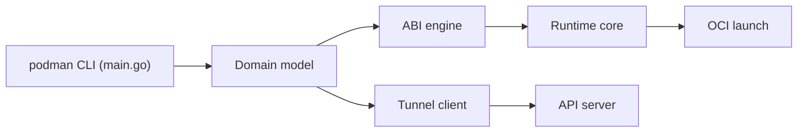

# containers/podman

> Outil sans démon pour gérer conteneurs OCI, images et pods, y compris sans droits root.

## Le problème
Docker impose un démon privilégié ; on veut des conteneurs rootless, compatibles avec les outils existants.

## Ce que ça fait vraiment
CLI compatible Docker qui gère images (pull, build via Buildah, push), cycle de vie des conteneurs (checkpoint via CRIU), pods, volumes, réseau (Netavark, pasta en rootless) et une API REST à deux surfaces (Docker-compatible et native). Sur Mac et Windows, `podman machine` lance une VM. Quadlet génère des unités systemd. Versions majeures 4 fois par an, seule la dernière est supportée.

## Comment c'est branché


## Essayer
```bash
podman run quay.io/podman/hello
```

## Coût et pièges
Gratuit. Le rootless demande un peu de configuration admin (subuid/subgid). Mac et Windows passent par une VM. Ne gère pas la signature/push spécialisés (Skopeo) ni le CRI Kubernetes (CRI-O). Licence non renseignée au catalogue.

## Ce que ce n'est pas
Pas un orchestrateur : les pods sont locaux. Les conteneurs Podman et Buildah ne se voient pas entre eux.

## Alternatives
Le README nomme Buildah (construction d'images), Skopeo (signature, push), CRI-O (CRI Kubernetes) et Podman Desktop (interface).

## Pour toi
Adopter : remplace Docker sans démon pour des builds et exécutions rootless en CI ou sur poste, avec une API compatible.
