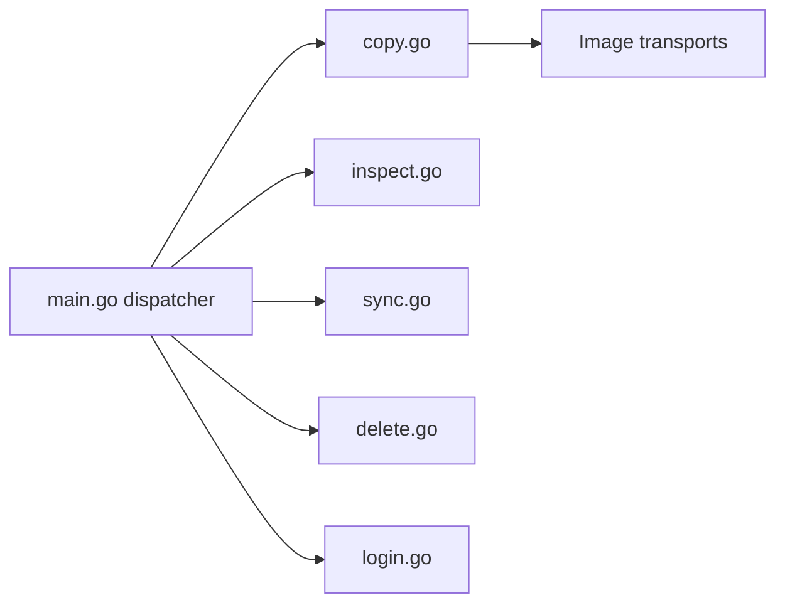

# containers/skopeo

> Outil en ligne de commande pour inspecter, copier et synchroniser des images de conteneurs sans démon.

## Le problème
Voir ou déplacer une image entre registres oblige souvent à la télécharger en local avec un démon et des droits root.

## Ce que ça fait vraiment
`skopeo inspect` lit manifeste et métadonnées à distance sans tirer l'image ; `copy` déplace entre registres, répertoires, archives ou stockage local ; `sync` réplique vers un registre interne ou un dossier (air-gapped) ; `delete`, `list-tags`, `login` et signature sigstore. Il supporte OCI et Docker v2, et ne requiert ni démon ni root.

## Comment c'est branché


## Essayer
```bash
skopeo inspect docker://registry.fedoraproject.org/fedora:latest
skopeo copy docker://quay.io/buildah/stable docker://registry.internal.company.com/buildah
skopeo sync --src docker --dest dir registry.example.com/busybox /media/usb
```

## Coût et pièges
Gratuit. Le README précise qu'il n'existe pas de site officiel : méfie-toi des faux sites de téléchargement.

## Ce que ce n'est pas
Ce n'est pas un moteur de conteneurs : il ne les lance pas ni ne les construit.

## Alternatives
- Buildah : construit des images (dépôt voisin, même écosystème).
- Podman : cité comme outil de gestion de conteneurs.

## Pour toi
Adopter pour miroiter ou auditer des images dans un pipeline MLOps : léger, sans démon, Apache-2.0 et très actif.

