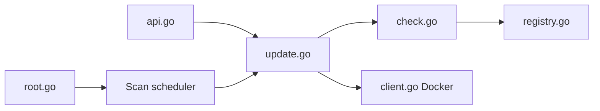

# containrrr/watchtower

> Met à jour automatiquement les images de conteneurs Docker en cours d'exécution, pour homelabs.

## Le problème
Garder à jour les images de ses conteneurs demande de les tirer et de les relancer à la main.

## Ce que ça fait vraiment
Surveille les conteneurs sélectionnés, compare leurs images au registre (digest), puis arrête le conteneur et le relance avec les mêmes options. Analyses planifiées ou déclenchées par API HTTP, hooks de cycle de vie, rapports, métriques Prometheus et notifications.

## Comment c'est branché


## Essayer
```bash
docker run --detach \
    --name watchtower \
    --volume /var/run/docker.sock:/var/run/docker.sock \
    containrrr/watchtower
```

## Coût et pièges
Gratuit, mais monte le socket Docker. Dépôt archivé : le README déclare le projet non maintenu.

## Ce que ce n'est pas
Ce n'est pas un outil pour production : le README le déconseille et oriente vers Kubernetes, MicroK8s ou k3s.

## Alternatives
- Kubernetes, MicroK8s, k3s : recommandés par le README pour les environnements sérieux.

## Pour toi
Ignorer : archivé et non maintenu, il donne un accès au socket Docker sans aucun correctif futur.

