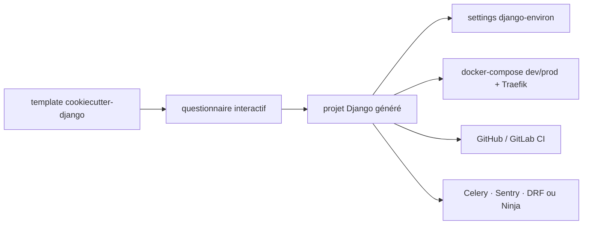

# cookiecutter/cookiecutter-django

> Générateur de projets Django prêts pour la production, configuré par questionnaire interactif.

## Le problème
`django-admin startproject` produit un squelette qu'il faut ensuite reconfigurer à la main :
settings par environnement, authentification, Docker, CI, tests — toujours les mêmes oublis.

## Ce que ça fait vraiment
Un template Cookiecutter qui pose une vingtaine de questions (nom, licence, fuseau, éditeur,
version PostgreSQL, fournisseur cloud, service mail, API REST, pipeline frontend, Celery, Sentry,
outil CI…) puis génère un projet Django 6.0 avec 100 % de couverture de tests au départ, settings
12-Factor via `django-environ`, modèle utilisateur personnalisé, inscription par `django-allauth`,
Bootstrap v5, envoi d'emails par Anymail, stockage média S3/GCS/Azure/nginx, Docker Compose pour le
développement et la production (Traefik + Let's Encrypt), Procfile Heroku et `pre-commit`.

## Comment c'est branché


## Essayer
```bash
uv tool install "cookiecutter>=1.7.0"
uvx cookiecutter https://github.com/cookiecutter/cookiecutter-django
cd reddit/
git init
git add .
git commit -m "first awesome commit"
```

## Coût et pièges
Gratuit. PostgreSQL partout (14 à 18), la configuration passe par variables d'environnement — ce qui
ne marche pas avec Apache/mod_wsgi. Les options cloud (S3, SES, Mailgun, Sentry, Heroku) impliquent
des comptes tiers et une facture à ta charge. Après génération il faut remplacer les valeurs
d'exemple ('Daniel Greenfeld', 'pydanny'…) par les tiennes.

## Ce que ce n'est pas
Ce n'est pas un framework ni une bibliothèque : c'est un générateur, exécuté une fois. Le README
prévient que le projet sert aussi de banc d'essai et ne correspond pas exactement au livre *Two
Scoops of Django*. MySQL n'est pas géré nativement.

## Alternatives
- `mabdullahadeel/cookiecutter-django-mysql` : fork pour une prise en charge complète de MySQL.
- Forker le dépôt : le README encourage explicitement à maintenir sa propre variante.

## Pour toi
Le bon réflexe quand tu dois livrer une interface Django autour d'un modèle plutôt qu'un simple
script — tu gagnes Docker, settings et CI en une commande.
