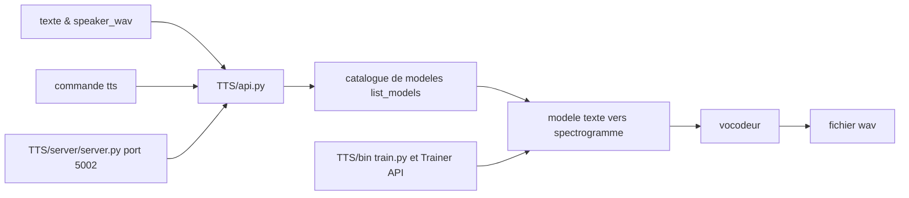

# coqui-ai/TTS

> **A Python speech-synthesis toolkit:** inference, voice cloning and training of TTS models.

## The problem

Without a library like this one, making a machine speak means wiring an acoustic model, a
vocoder, a speaker encoder and a data pipeline together by hand, each architecture living in
its own research repo with its own formats. The README offers the opposite: one API over
pretrained models in "+1100 languages", plus tooling to train new models and curate datasets.

## What it actually does

Three documented uses. **Inference**: `TTS("tts_models/…")` pulls a model from the catalogue
and writes a wav via `tts_to_file`. **Voice cloning**: the multilingual ⓍTTS and YourTTS
models take a reference `speaker_wav` and a `language` — the README claims 16 languages for
ⓍTTSv2 and streaming latency under 200ms. **Voice conversion**: `voice_conversion_to_file`
(FreeVC) maps a source voice onto a target one, and `tts_with_vc_to_file` combines both so any
model in the catalogue can clone. The repo also carries the model implementations themselves:
Tacotron/Tacotron2, Glow-TTS, VITS, FastPitch, OverFlow on the spectrogram side, MelGAN,
ParallelWaveGAN, HiFiGAN, UnivNet on the vocoder side, plus a `Trainer API` and a
`dataset_analysis` folder. Tortoise, Bark and the ~1100 Fairseq models are re-exposed through
the same interface.

## How it is wired



The README describes three front doors onto the same core: the `TTS.api` Python API, the `tts`
command line, and an HTTP server `TTS/server/server.py` published on port 5002 in the Docker
image. All of them resolve a model name from the catalogue (`--list_models`), which selects an
acoustic model plus a vocoder — hence the separate `--model_name` and `--vocoder_name` flags.
The stated directory layout splits `TTS/tts/`, `TTS/vocoder/` and `TTS/speaker_encoder/`, with
training scripts under `TTS/bin/`.

## Trying it

```bash
pip install TTS
tts --list_models
tts --text "Text for TTS" --out_path output/path/speech.wav
```

To develop or train, the README gives:

```bash
git clone https://github.com/coqui-ai/TTS
pip install -e .[all,dev,notebooks]  # Select the relevant extras
```

Or with no install at all, through Docker:

```bash
docker run --rm -it -p 5002:5002 --entrypoint /bin/bash ghcr.io/coqui-ai/tts-cpu
python3 TTS/server/server.py --list_models #To get the list of available models
python3 TTS/server/server.py --model_name tts_models/en/vctk/vits # To start a server
```

## Cost and traps

Nothing to pay and no API key: models are downloaded. The constraints sit elsewhere. The README
states testing on Ubuntu 18.04 with **python >= 3.9, < 3.12** — an upper bound that rules out
recent Pythons. A GPU is not mandatory (the sample code falls back to `cpu` when CUDA is
missing, and a `tts-cpu` Docker image exists) but the voice-conversion example hardcodes
`.to("cuda")` and training assumes one. Required VRAM is not documented. Windows is not
supported directly: the README points to a Stack Overflow answer written by a contributor.
Finally MPL-2.0 is file-level copyleft — changes to the project's own files stay open, which is
manageable but worth reading before integration.

## What it is not

It is not a hosted service: everything runs locally, there is no endpoint to call. It is not
speech recognition either — the direction is text to audio, never the reverse. The performance
chart in the README compares "TTS*" and "Judy*" models that the text explicitly calls
**internal and not released open-source**, so those curves are not all reproducible from this
repo. And the README says nothing about the terms of use for cloned voices, nor about the
licences of the pretrained models, which are not the same thing as the code licence.

## Alternatives

- **suno-ai/bark** (named in the README, and integrated here): if you want Bark's unconstrained
  voice cloning without the 🐸TTS layer on top.
- **neonbjb/tortoise-tts** (original repo, named in the README): the Tortoise reference, which
  this project re-exposes with what it calls faster inference.
- **netease-youdao/EmotiVoice** (catalogue neighbour): another open speech-synthesis stack,
  worth a look if expressive/emotional control matters more than language coverage.

## For you

For a data/AI profile this is the standard entry point to prototype local speech synthesis and
voice cloning, with training recipes to fine-tune on your own voice or language. Watch rather
than adopt outright: the `python < 3.12` bound and the MPL copyleft are two calls to make
first, and the README promises nothing about running it in production.
