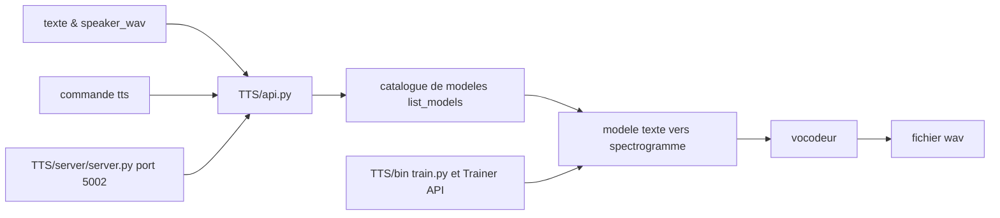

# coqui-ai/TTS

> **Boîte à outils Python de synthèse vocale :** inférence, clonage de voix et entraînement de modèles TTS.

## Le problème

Sans cette bibliothèque, faire parler une machine suppose d'assembler soi-même un modèle
acoustique, un vocodeur, un encodeur de locuteur et la chaîne de données qui va avec, chaque
architecture vivant dans son dépôt de recherche avec son propre format. Le README décrit
justement l'inverse : une seule API pour des modèles pré-entraînés « dans +1100 langues »,
plus les outils d'entraînement et de curation de jeux de données.

## Ce que ça fait vraiment

Trois usages sont documentés. **Inférence** : `TTS("tts_models/…")` télécharge un modèle de la
liste et rend un wav, avec `tts_to_file`. **Clonage de voix** : les modèles multilingues ⓍTTS
et YourTTS prennent un `speaker_wav` de référence et une `language`, et parlent dans cette
voix — le README annonce 16 langues pour ⓍTTSv2 et une latence de streaming annoncée sous
200 ms. **Conversion de voix** : `voice_conversion_to_file` (FreeVC) transporte une voix
source vers une voix cible, et `tts_with_vc_to_file` combine les deux pour cloner avec
n'importe quel modèle du catalogue. Le dépôt embarque aussi les implémentations elles-mêmes :
Tacotron/Tacotron2, Glow-TTS, VITS, FastPitch, OverFlow côté spectrogramme, MelGAN,
ParallelWaveGAN, HiFiGAN, UnivNet côté vocodeur, plus un `Trainer API` et un dossier
`dataset_analysis` pour l'entraînement et la préparation de corpus. Les modèles Tortoise,
Bark et les ~1100 modèles Fairseq sont réexposés via la même interface.

## Comment c'est branché



Le README décrit trois portes d'entrée sur le même cœur : l'API Python `TTS.api`, la commande
`tts`, et un serveur HTTP `TTS/server/server.py` exposé sur le port 5002 dans l'image Docker.
Toutes passent par un nom de modèle du catalogue (`--list_models`), qui sélectionne un couple
modèle acoustique + vocodeur — d'où les options `--model_name` et `--vocoder_name` séparées.
La structure de répertoires annoncée sépare `TTS/tts/`, `TTS/vocoder/` et `TTS/speaker_encoder/`,
et `TTS/bin/` contient les scripts d'entraînement.

## Essayer

```bash
pip install TTS
tts --list_models
tts --text "Text for TTS" --out_path output/path/speech.wav
```

Pour développer ou entraîner, le README donne :

```bash
git clone https://github.com/coqui-ai/TTS
pip install -e .[all,dev,notebooks]  # Select the relevant extras
```

Et sans rien installer, via l'image Docker :

```bash
docker run --rm -it -p 5002:5002 --entrypoint /bin/bash ghcr.io/coqui-ai/tts-cpu
python3 TTS/server/server.py --list_models #To get the list of available models
python3 TTS/server/server.py --model_name tts_models/en/vctk/vits # To start a server
```

## Coût et pièges

Rien à payer et aucune clé d'API : les modèles se téléchargent. Les contraintes sont ailleurs.
Le README annonce une compatibilité testée sur Ubuntu 18.04 avec **python >= 3.9, < 3.12** —
une borne haute qui exclut les Python récents. Le GPU n'est pas obligatoire (le code d'exemple
bascule sur `cpu` si CUDA est absent, et une image Docker `tts-cpu` existe) mais l'exemple de
conversion de voix force `.to("cuda")` et l'entraînement le suppose. La VRAM nécessaire n'est
pas documentée. L'installation Windows n'est pas prise en charge directement : le README
renvoie à une réponse Stack Overflow écrite par un contributeur. Enfin la licence MPL-2.0 est
un copyleft de fichier : les modifications apportées aux fichiers du projet doivent rester
ouvertes, ce qui se gère mais se lit avant intégration.

## Ce que ce n'est pas

Ce n'est pas un service hébergé : tout tourne chez vous, il n'y a pas d'endpoint à appeler.
Ce n'est pas non plus de la reconnaissance vocale — le sens est texte → audio, jamais
l'inverse. Le graphe de performance du README compare des modèles « TTS* » et « Judy* » que le
texte présente explicitement comme **internes et non publiés open-source** : les courbes
montrées ne sont donc pas toutes reproductibles avec le dépôt. Et le README ne dit rien des
conditions d'usage des voix clonées ni des licences des modèles pré-entraînés, qui ne se
confondent pas avec celle du code.

## Alternatives

- **suno-ai/bark** (cité par le README, et intégré dedans) : si vous voulez le clonage de voix
  non contraint de Bark sans passer par la couche 🐸TTS.
- **neonbjb/tortoise-tts** (dépôt d'origine cité par le README) : la référence Tortoise, que ce
  dépôt réexpose avec, dit-il, une inférence plus rapide.
- **netease-youdao/EmotiVoice** (voisin du catalogue) : autre synthèse vocale ouverte, à
  regarder si l'axe expressif/émotionnel prime sur la couverture multilingue.

## Pour toi

Pour un profil data/IA, c'est le point d'entrée standard pour prototyper de la synthèse vocale
et du clonage en local, avec en prime les recettes d'entraînement pour fine-tuner sur sa propre
voix ou sa propre langue. À surveiller plutôt qu'à poser tel quel en production : la borne
`python < 3.12` et le copyleft MPL sont deux points à trancher avant, et le README ne documente
aucune garantie d'exploitation.
