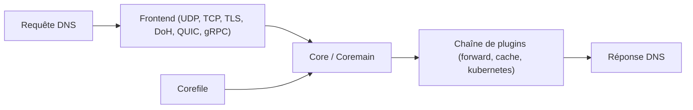

# coredns/coredns

> Serveur DNS en Go à chaîne de plugins, projet CNCF, pour équipes d'infrastructure et Kubernetes.

## Le problème
Servir et relayer du DNS de façon configurable (zones locales, transfert, cache, résolution Kubernetes) sans serveur monolithique rigide.

## Ce que ça fait vraiment
Un cœur reçoit les requêtes (UDP/TCP, DoT, DoH, DoH3, DoQ, gRPC), lit le `Corefile` pour bâtir une chaîne de plugins, et chaque plugin traite ou transmet la requête : `forward`, `cache`, `file`, `dnssec`, `kubernetes`, `etcd`, `prometheus`, `log`, `rewrite`, `route53`… On étend en écrivant ou compilant d'autres plugins. Journaux JSON disponibles.

## Comment c'est branché


## Essayer
```bash
git clone https://github.com/coredns/coredns
cd coredns
make
cat > Corefile <<EOF
.:53 {
    forward . 8.8.8.8
    log
}
EOF
./coredns -conf Corefile
dig @127.0.0.1 google.com
```

## Coût et pièges
Gratuit. Demande Go 1.26 ou plus pour compiler. Le port 53 est souvent occupé (utiliser 1053 ou `-dns.port`). Le DoH sans terminaison TLS exige un proxy devant. Politique de dépréciation en trois versions : une config peut cesser de démarrer.

## Ce que ce n'est pas
Pas un résolveur récursif complet en soi : il relaie souvent vers un autre serveur. Pas un outil de données.

## Alternatives
Le README ne nomme aucune autre solution DNS.

## Pour toi
Surveiller : tu le croiseras dans Kubernetes plutôt que de le déployer seul ; utile à connaître pour le DNS de tes clusters, sans usage direct pour un travail de modèles.

