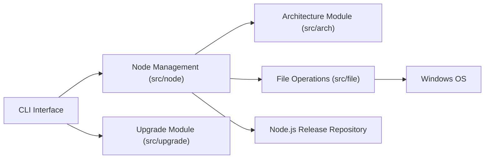

# coreybutler/nvm-windows

> Gestionnaire de versions Node.js pour Windows, réécrit en version 2, distinct du nvm Mac/Linux.

## Le problème
Sous Windows, changer de version de Node.js selon les projets est laborieux et demande souvent des droits d'administrateur.

## Ce que ça fait vraiment
La v2 propose deux modes : shim (sans lien symbolique, écrit en Zig) et link (jonctions avec repli sur les liens symboliques). Elle épingle une version par répertoire, installe les versions manquantes, permet des installations parallèles, des alias et des téléchargements locaux. Intégrations Windows : registre, journal d'événements, notifications. Aucun droit d'administrateur obligatoire.

## Comment c'est branché

Le schéma décrit une version en Go avec liens symboliques ; le README parle d'une réécriture en v2 (Zig) : ils ne concordent pas.

## Essayer
Aucune commande documentée dans le README (renvoi vers le site et la documentation).

## Coût et pièges
Le noyau est gratuit ; des « Certified Builds » commerciales (MSI, Intune, signature, journalisation d'audit, politiques AD/Entra, SBOM) sont annoncées en add-on pour septembre 2026. Aucune licence détectée par le catalogue.

## Ce que ce n'est pas
Ce n'est pas nvm : le README précise qu'il s'agit d'un projet distinct, sans clone. Il n'existe pas pour Mac ou Linux.

## Alternatives
- nvm (le projet original, cité dans le README) : pour Mac et Linux uniquement.

## Pour toi
À ignorer : utile seulement pour du Node.js sous Windows, et l'absence de licence détectée pèse pour un usage en entreprise.

