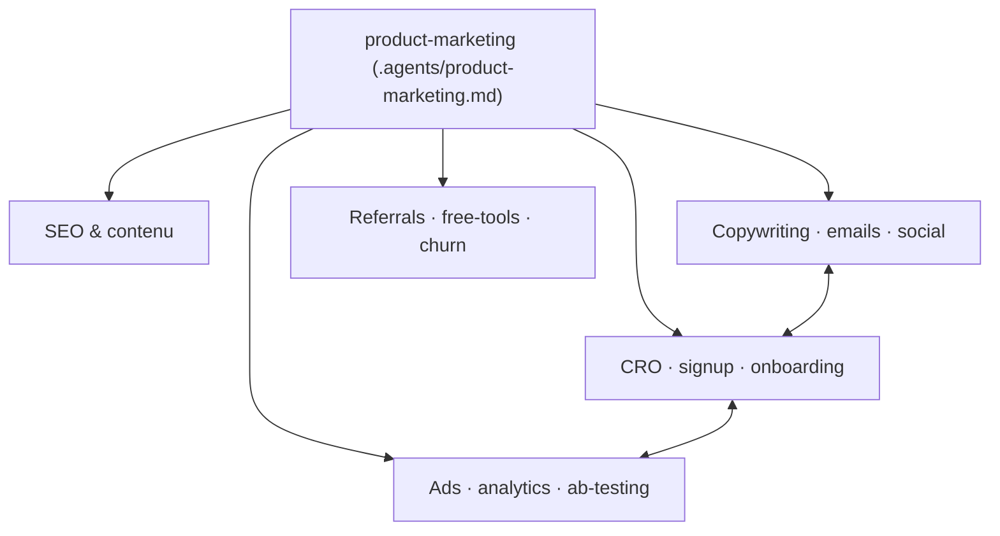

# coreyhaines31/marketingskills

> Collection de skills marketing pour agents de code : CRO, copy, SEO, analytics, growth.

## Le problème
Un agent de code répond sur une tâche marketing sans cadre méthodologique : il produit du texte plausible, pas une page optimisée pour la conversion.

## Ce que ça fait vraiment
Une cinquantaine de skills en Markdown, chacun déclenché par un type de demande : `cro`, `copywriting`, `seo-audit`, `ai-seo`, `analytics`, `ab-testing`, `emails`, `pricing`, `churn-prevention`, `referrals`, `launch`, `revops`… Ils se référencent entre eux et partagent un contexte commun : `product-marketing` est le socle, lu en premier par tous les autres pour connaître produit, audience et positionnement. Compatible Claude Code, Codex, Cursor, Windsurf et tout agent conforme à la spec Agent Skills.

## Comment c'est branché


## Essayer
```bash
npx skills add coreyhaines31/marketingskills
npx skills add coreyhaines31/marketingskills -a claude-code
npx skills add coreyhaines31/marketingskills --list
```

## Coût et pièges
Gratuit, MIT. Piège d'installation signalé : lancée **depuis** une session d'agent, la CLI tourne en non interactif et peut n'installer que dans `.agents/skills/`, que Claude Code ne lit pas — d'où le `-a claude-code`. La migration v1.x → v2.0 laisse des dossiers périmés à supprimer à la main.

## Ce que ce n'est pas
Ce n'est pas un outil : ce sont des fichiers Markdown d'instructions, sans exécution ni données. Le financement passe par des « Verified Partners » (Converly, Ploy) : intégrations d'outils divulguées, présentées comme n'influençant pas les recommandations des skills — à vérifier soi-même.

## Alternatives
- SkillKit (`npx skillkit install`) : voie d'installation alternative multi-agents.

## Pour toi
À surveiller : hors de ton cœur technique, mais bon exemple de bibliothèque de skills qui se référencent autour d'un fichier de contexte partagé.
