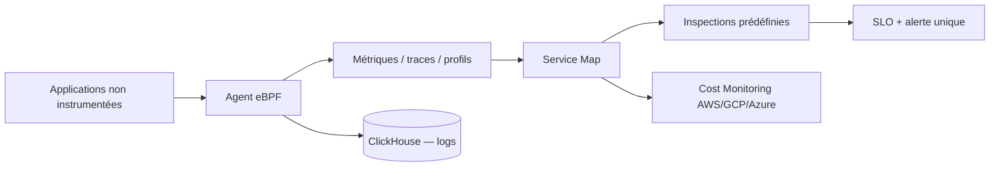

# coroot/coroot

> Observabilité sans instrumentation : métriques, logs, traces et profils collectés par eBPF.

## Le problème
Collecter n'est pas observer. On accumule métriques, logs et traces, puis il faut encore savoir
lesquels regarder, et instrumenter le legacy qu'on ne peut pas recompiler.

## Ce que ça fait vraiment
Collecte automatique par eBPF, donc sans toucher au code des applications, y compris pour du
legacy ou du tiers. Construit une Service Map censée couvrir tout le système. Des inspections
prédéfinies auditent chaque application sans configuration ; quand un SLO est manqué, une seule
alerte agrège les résultats de toutes les inspections pertinentes. Regroupement automatique des
logs en motifs, recherche sur ClickHouse, profilage CPU/mémoire jusqu'à la ligne de code.
Suivi de déploiement : chaque rollout Kubernetes est comparé au précédent, coût cloud inclus.

## Comment c'est branché


## Essayer
```bash
# Aucune commande documentée dans le README : il renvoie au guide d'installation
# (conteneur Docker ou déploiement Kubernetes) et à la démo demo.coroot.com.
```

## Coût et pièges
Le README ne détaille ni licence, ni prix, ni découpage entre édition libre et payante. eBPF
implique un noyau récent et des privilèges élevés sur les nœuds. ClickHouse pour les logs, c'est
un composant de plus à exploiter. Le suivi de coûts est annoncé sans accès au compte cloud, donc
par estimation.

## Ce que ce n'est pas
Ce n'est pas un remplaçant de Prometheus pour des métriques métier : c'est de l'auto-découverte
d'infrastructure. Le « 80 % des problèmes identifiés automatiquement » vient de l'éditeur.

## Alternatives
Aucune alternative nommée dans le README ; seul OpenTelemetry est cité, comme standard supporté.

## Pour toi
À regarder si tu exploites du Kubernetes non instrumenté ; pas prioritaire côté data science.
