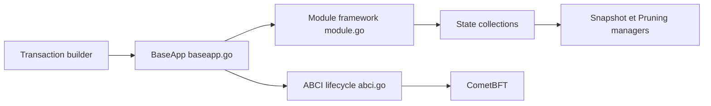

# cosmos/cosmos-sdk

> Framework Go modulaire pour construire des blockchains de couche 1 spécifiques à une application.

## Le problème
Créer sa propre blockchain souveraine sans réécrire consensus, comptes, gouvernance et interopérabilité.

## Ce que ça fait vraiment
Fournit `BaseApp`, le cycle de vie ABCI, un cadre de modules (banque, staking, gouvernance…), routage de messages, gestion d'état, snapshots et élagage, clients de requête et de diffusion de transactions. Interopérabilité IBC, moteur de consensus CometBFT recommandé. Le README annonce plus de 200 chaînes en production.

## Comment c'est branché

## Essayer
Aucune commande documentée dans le README : renvoi vers le tutoriel et la documentation en ligne.

## Coût et pièges
Gratuit. Le répertoire `enterprise/` a des conditions de licence différentes de celles du cœur, non détaillées dans le README.

## Ce que ce n'est pas
Pas une chaîne prête à l'emploi : c'est un kit de construction Go. L'application Cosmos Hub vit dans le dépôt cosmos/gaia.

## Alternatives
CometBFT (moteur de consensus), IBC (interopérabilité) et Cosmos EVM (couche EVM), tous cités comme parties de la pile.

## Pour toi
À ignorer : outillage blockchain sans usage dans un travail data/IA/MLOps, et les modules « enterprise » ont une licence à vérifier.

