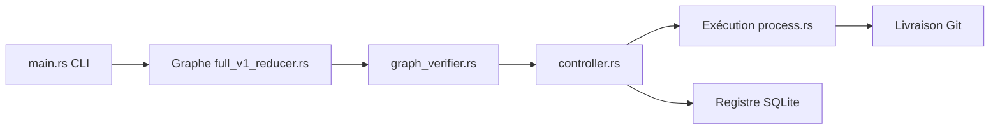

# covibes/zeroshot

> Exécuteur de graphes multi-agents où un agent code, d'autres relisent, et la livraison attend les vérifications.

## Le problème
L'agent qui écrit le code décide lui-même qu'il fonctionne ; la boucle d'orchestration cachée dans les prompts est difficile à inspecter.

## Ce que ça fait vraiment
Un exécutable natif (Rust) déroule un graphe explicite : un travailleur implémente, acceptation et revue de code tournent en parallèle, les rejets partent en réparation bornée puis on livre (branche, PR ou merge). Chaque événement est écrit dans un registre SQLite durable. Trois cibles : local (réutilise les connexions Codex ou Claude Code), conteneur Docker auto-hébergé et cloud Zeroshot. Interface web pour profils et historique, client Python, mode ACP expérimental.

## Comment c'est branché


## Essayer
```bash
npm install -g @the-open-engine-company/zeroshot
zeroshot template list
zeroshot template show software-change
zeroshot ui
```

## Coût et pièges
Abonnement ou clé d'API Codex ou Claude à ta charge ; cible cloud avec compte. La version 8 est annoncée comme une rupture d'interface (runtime Node.js retiré).

## Ce que ce n'est pas
Pas une garantie de correction : les revues sont faites par d'autres agents. Le mode ACP est marqué expérimental. Les cibles cloud et livraison n'ont pas été examinées en détail.

## Alternatives
Aucune alternative nommée dans le README.

## Pour toi
À surveiller : l'idée d'un graphe de contrôle auditable avec revue indépendante est intéressante pour des agents de code, mais le dépôt a moins de neuf mois et reste instable.

