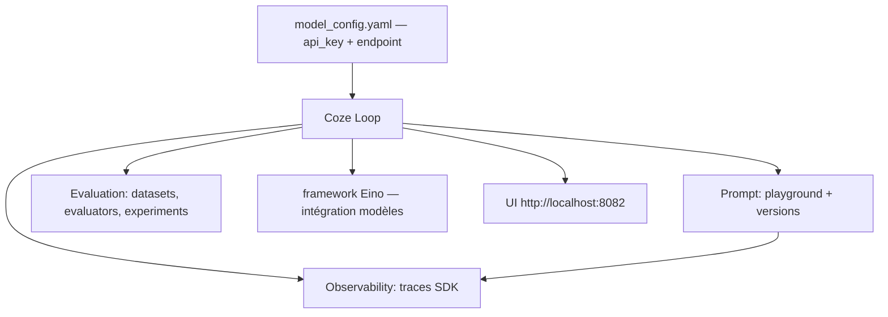

# coze-dev/coze-loop

> Plateforme de développement, d'évaluation et d'observabilité pour agents IA, auto-hébergeable.

## Le problème
Un agent se développe dans un notebook, s'évalue à l'œil et se surveille pas du tout.
Les prompts n'ont pas de versions, les sorties n'ont pas de métriques, les appels n'ont pas de traces.

## Ce que ça fait vraiment
Un module de prompts avec Playground visuel : écriture, débogage, comparaison de sorties entre LLM, versionnement.
Un module d'évaluation : jeux d'évaluation gérés, évaluateurs, expériences, tests multi-dimensions automatisés (exactitude, concision, conformité).
Un module d'observabilité qui enregistre chaque étape de l'exécution — parsing du prompt, appel modèle, exécution d'outil — avec résultats intermédiaires et exceptions.
Le SDK existe en trois langages, commun aux éditions commerciale et open source, avec seulement des paramètres d'initialisation à changer.

## Comment c'est branché


## Essayer
```bash
git clone https://github.com/coze-dev/coze-loop.git
cd coze-loop
# éditer release/deployment/docker-compose/conf/model_config.yaml (api_key, model)
make compose-up
# ou en Kubernetes :
helm pull oci://docker.io/cozedev/coze-loop --version 1.0.0-helm
make helm-up
```

## Coût et pièges
L'édition open source est gratuite mais impose une clé Volcengine Ark (ou BytePlus ModelArk) et son Endpoint ID dans `model_config.yaml`.
Le README avertit explicitement contre un déploiement sur réseau public : inscription ouverte, adresse d'écoute, SSRF et élévations de privilèges horizontales dans certaines API.

## Ce que ce n'est pas
Ce n'est pas la plateforme complète : c'est l'édition open source de modules « fondamentaux » d'un produit commercial, ByteDance gardant le reste.
Ce n'est pas non plus prêt pour l'exposition : le mode par défaut est le mode développement, avec modification de fichiers backend sans redéploiement.

## Alternatives
- Framework Eino (équipe CloudWeGo) : cité comme la couche d'intégration des modèles, utilisable seule.

## Pour toi
Le triptyque prompt/éval/traces est le bon découpage ; pèse la dépendance à Volcengine Ark avant d'y mettre tes expériences.
