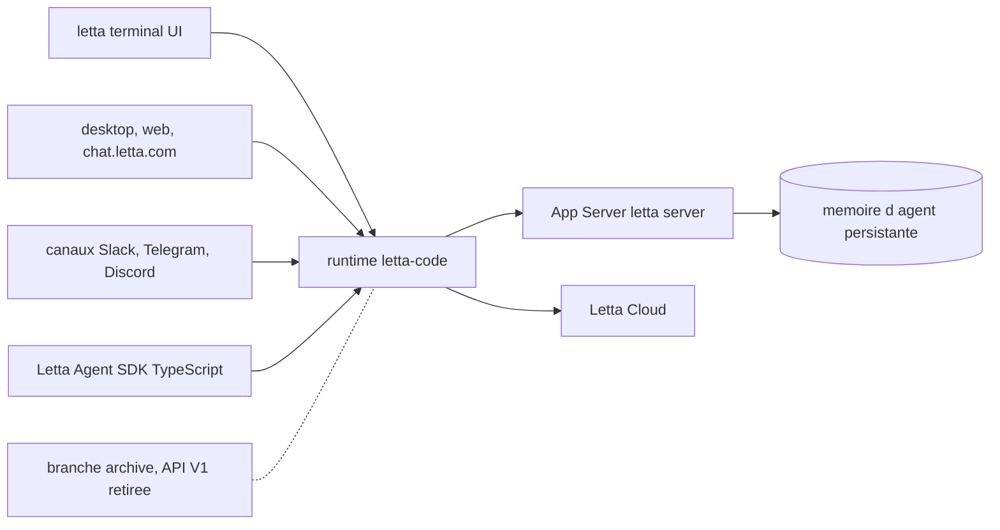

# cpacker/MemGPT

> **Former MemGPT repository, now Letta, stateful agents with memory — the code lives elsewhere.**

## The problem

A plain conversational agent starts from scratch every session: it keeps neither what it was
taught, nor its identity, nor the history of the exchange. Letta, formerly MemGPT, presents
itself as an answer to that gap: stateful agents with memory that persists and improves over
time. A second problem is specific to this repository: finding out where the code went.

## What it actually does

This repository no longer does much on its own. Its README is essentially a signpost: the
current source lives in `letta-ai/letta-code`, which includes the agent harness, the interactive
terminal UI, the App Server, the channels and the runtime used by the desktop and web apps. The
`archive` branch keeps the retired Letta V1 API server; existing tags and releases stay
available for reproducibility. The README states that active projects should use the current
source rather than this one.

## How it is wired



The README lists several entry points — terminal, desktop and web apps, chat channels, a
TypeScript SDK — all converging on the `letta-code` runtime, which relies on an App Server
started with `letta server` for local or self-hosted agents, and on Letta Cloud to keep agent
memory, identity and conversations available across computers. How these parts are split
internally is not documented here.

## Trying it

```bash
npm install -g @letta-ai/letta-code
letta
letta server
```

These are the only commands in the README. Everything else points to `docs.letta.com` for
current installation, development and deployment instructions.

## Cost and traps

The README announces no price, but Node and npm are needed for the global install, and Letta
Cloud is a hosted third-party service that implies an account. Nothing is said about which
language models are used or which API key they would require — that is the main hole in this
page. The real trap is upstream: this repository is no longer the source, so cloning
`cpacker/MemGPT` expecting current code leads nowhere. No licence is declared in what we read.

## What it is not

It is not the repository to use: the README itself says the active code is elsewhere. It is not
MemGPT as it once circulated either — the project was renamed Letta and rewritten, and the
historical implementation of the MemGPT paper is no longer described here. Finally, it is not a
Python library: installation goes through npm and the advertised SDK is TypeScript.

## Alternatives

The README names no competitor, only its own offshoots: `letta-ai/letta-code` for the current
code, the `archive` branch of `letta-ai/letta` for the retired V1 API. No comparable alternative
from the catalogue was supplied for this repository.

## For you

Genuine interest if persistent agent memory is your subject, but follow it on
`letta-ai/letta-code`, not here. This repository now only serves to retrieve the old releases.
