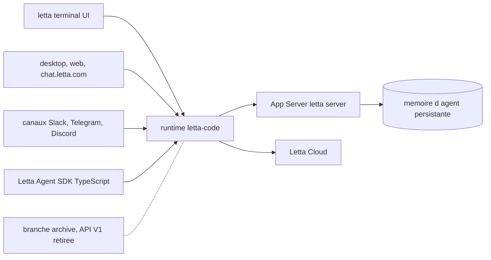

# cpacker/MemGPT

> **Ancien dépôt de MemGPT, devenu Letta, agents à mémoire persistante — le code vit ailleurs.**

## Le problème

Un agent conversationnel classique repart de zéro à chaque session : il ne retient ni ce qu'on
lui a appris, ni son identité, ni l'historique des échanges. Letta, ex-MemGPT, se présente comme
une réponse à ce trou : des agents dits « stateful », dotés d'une mémoire qui persiste et
s'enrichit dans le temps. Second problème, propre à ce dépôt-ci : savoir où est passé le code.

## Ce que ça fait vraiment

Ce dépôt ne fait plus grand-chose lui-même. Son README est essentiellement un panneau de
redirection : le code actif vit dans `letta-ai/letta-code`, qui contient le harness d'agent,
l'interface terminal interactive, l'App Server, les canaux et le runtime des applications
desktop et web. La branche `archive` conserve l'ancien serveur d'API Letta V1, retiré ; les tags
et releases restent disponibles pour la reproductibilité. Le README indique que les projets
actifs doivent utiliser la source courante, pas celle-ci.

## Comment c'est branché



Le README décrit plusieurs points d'entrée — terminal, apps desktop et web, canaux de chat,
SDK TypeScript — qui convergent vers le runtime de `letta-code`, lequel s'appuie sur un App
Server lancé par `letta server` pour des agents locaux ou auto-hébergés, et sur Letta Cloud
pour conserver mémoire, identité et conversations d'une machine à l'autre. Le découpage interne
de ces composants n'est pas documenté ici.

## Essayer

```bash
npm install -g @letta-ai/letta-code
letta
letta server
```

Ce sont les seules commandes du README. Tout le reste renvoie à `docs.letta.com` pour
l'installation, le développement et le déploiement à jour.

## Coût et pièges

Le README n'annonce aucun prix, mais il faut Node et npm pour l'installation globale, et Letta
Cloud est un service tiers hébergé qui suppose un compte. Aucune indication sur les modèles de
langage utilisés ni sur la clé d'API qu'ils exigeraient — c'est le trou principal de cette page.
Le vrai piège ici est en amont : ce dépôt n'est plus la source, cloner `cpacker/MemGPT` en
espérant le code courant mène à une impasse. Aucune licence n'est déclarée dans ce que l'on lit.

## Ce que ce n'est pas

Ce n'est pas le dépôt à utiliser : le README dit lui-même que le code actif est ailleurs. Ce
n'est pas non plus MemGPT tel qu'il a circulé — le projet a été renommé Letta et réécrit, et
l'implémentation historique de l'article MemGPT n'est plus décrite ici. Enfin, ce n'est pas une
bibliothèque Python : l'installation passe par npm et le SDK annoncé est TypeScript.

## Alternatives

Le README ne nomme aucun concurrent, seulement ses propres déclinaisons : `letta-ai/letta-code`
pour le code courant, la branche `archive` de `letta-ai/letta` pour l'API V1 retirée. Aucune
alternative comparable dans le catalogue n'est fournie pour ce dépôt.

## Pour toi

Intérêt réel si la mémoire persistante d'agents est un sujet, mais à suivre sur
`letta-ai/letta-code`, pas ici. Ce dépôt-ci ne sert plus qu'à retrouver les anciennes releases.
