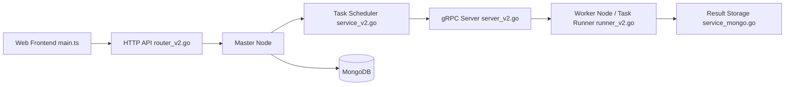

# crawlab-team/crawlab

> Plateforme web pour planifier et superviser des crawlers distribués, quel que soit leur langage ou framework.

## Le problème
Des spiders dispersés (Scrapy, Puppeteer, scripts maison) sans endroit commun pour les déployer, planifier et suivre les logs et résultats.

## Ce que ça fait vraiment
Un nœud maître (API, ordonnanceur, déploiement des spiders) distribue les tâches à des workers via gRPC. Les workers lancent les crawlers comme des processus shell, avec l'identifiant de tâche en variable d'environnement. MongoDB stocke l'état et la file, SeaweedFS synchronise les fichiers et logs. Un SDK Python sauvegarde les résultats.

## Comment c'est branché


## Essayer
```bash
git clone https://github.com/crawlab-team/examples
cd examples/docker/basic
docker-compose up -d
```
Puis ouvrir `http://localhost:8080`.

## Coût et pièges
Gratuit (BSD-3-Clause) ; demande Docker Compose, MongoDB (4.2 dans l'exemple) et SeaweedFS. 166 issues ouvertes. Le README signale l'absence de versionnage des spiders.

## Ce que ce n'est pas
Pas un framework de crawling : il orchestre des spiders que vous écrivez. Il ne gère ni proxys ni contournement de protections ; respecter robots.txt et les conditions des sites visés reste à votre charge.

## Alternatives
- ScrapydWeb : interface riche, mais limité à Scrapy.
- Gerapy : configuration de règles de crawl, Scrapy uniquement.
- SpiderKeeper : plus simple, Scrapy uniquement.

## Pour toi
À surveiller : pertinent si tu alimentes des datasets par crawling à plusieurs langages ; sinon un Scrapy simple suffit et évite MongoDB plus SeaweedFS.

