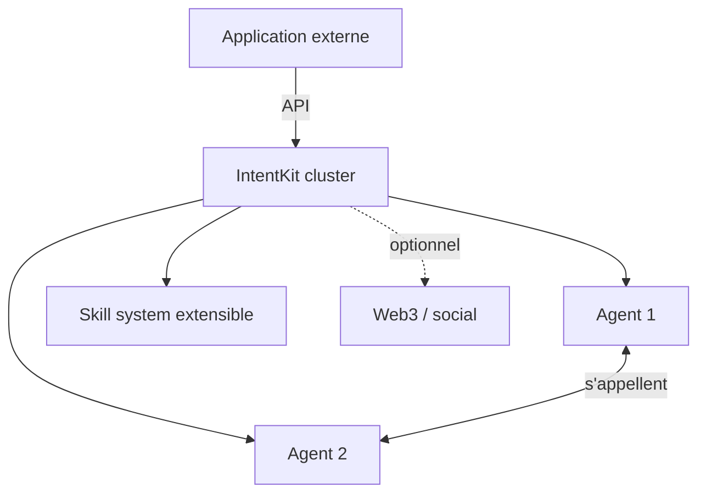

# crestalnetwork/intentkit

> Cluster d'agents IA cloud-native auto-hébergé gérant une équipe collaborative d'agents.

## Le problème
Les agents locaux exigent du matériel coûteux et de larges permissions locales. Faire collaborer plusieurs agents fiables dans le cloud manque d'un cadre prêt à l'emploi.

## Ce que ça fait vraiment
Cluster d'agents cloud-native : efficacité de ressources, agents incapables d'accéder à tes clés secrètes (secure by design), agents qui s'appellent entre eux, prêt à l'emploi, intégrations Web3/blockchain optionnelles, réseaux sociaux, système de skills extensible. Utilisable en self-deploy, comme bibliothèque Python, ou via API.

## Comment c'est branché

## Essayer
Aucune commande d'installation dans le README (renvoie vers le Deployment Guide). L'écrire : voir le guide de déploiement du dépôt.

## Coût et pièges
Gratuit à héberger ; clés LLM et services tiers (Web3, social) à ta charge. README bref, peu de détail technique — matière insuffisante pour juger la maturité réelle.

## Ce que ce n'est pas
Pas un assistant local : orienté cloud, minimal côté ressources locales. README court, promesses non détaillées.

## Alternatives
- OpenClaw : cité comme exemple d'agent local-first (approche opposée).

## Pour toi
À suivre si tu montes une équipe d'agents cloud ; l'accent Web3 et le README maigre invitent à la prudence.
