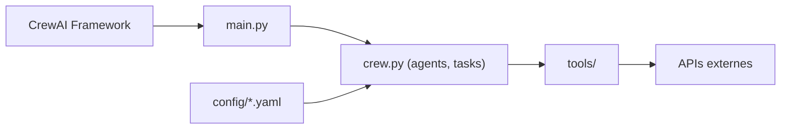

# crewAIInc/crewAI-examples

> Collection d'applications complètes montrant comment orchestrer des agents IA avec CrewAI.

## Le problème
Passer de la documentation d'un framework multi-agents à une application réelle est difficile.

## Ce que ça fait vraiment
Exemples autonomes : Flows (générateur de contenu, réponse automatique aux e-mails, score de leads avec humain dans la boucle, écriture de livre en parallèle) et Crews (marketing, recrutement, analyse boursière, plan de voyage, générateur de jeux), plus intégrations LangGraph, Azure et NVIDIA, et des notebooks. Agents et tâches sont définis en YAML ; dépendances gérées avec UV. Écrits pour CrewAI 0.152.0.

## Comment c'est branché


## Essayer
```bash
git clone https://github.com/crewAIInc/crewAI-examples.git
cd crewAI-examples
cd crews/marketing_strategy
uv sync
```

## Coût et pièges
Chaque exemple appelle des LLM : clés et facture à ta charge. Dépôt archivé (dernier push avril 2026), figé sur une version de CrewAI ; aucune licence déclarée.

## Ce que ce n'est pas
Pas du code de production : des démos. Les exemples peuvent ne plus tourner avec les versions récentes.

## Alternatives
- CrewAI Cookbook : guides ciblés par fonctionnalité.

## Pour toi
À surveiller comme source d'idées de flux d'agents, mais archivé et sans licence : ne pas copier tel quel.

