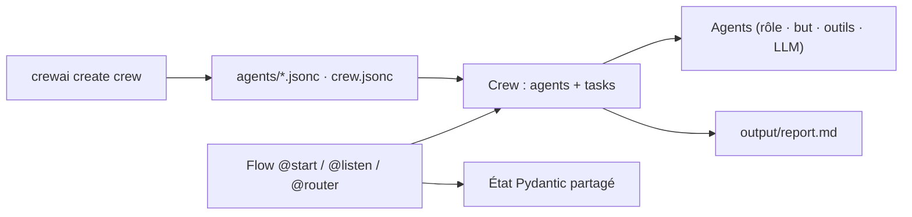

# crewAIInc/crewAI

> Framework Python d'orchestration multi-agents, entre autonomie et contrôle événementiel.

## Le problème
Un prompt unique ne suffit plus dès qu'il faut du travail en plusieurs étapes, des rôles spécialisés, des outils et une revue humaine — mais l'autonomie totale rend le résultat imprévisible.

## Ce que ça fait vraiment
Deux primitives complémentaires. Les **Crews** : des équipes d'agents à rôles, objectifs et outils, qui délèguent entre eux (process séquentiel ou hiérarchique avec manager). Les **Flows** : des workflows événementiels avec état structuré (Pydantic), branchement conditionnel via `@router`, opérateurs `or_`/`and_`, et intégration de code Python ordinaire. `crewai create crew` génère un projet JSON-first (`agents/*.jsonc`, `crew.jsonc`) ; `--classic` rend l'ancien gabarit Python/YAML.

## Comment c'est branché


## Essayer
```bash
uv tool install crewai
crewai create crew latest-ai-development
crewai install
crewai run
```

## Coût et pièges
Python ≥ 3.10 et < 3.14. Par défaut les agents appellent l'API OpenAI : clé à ta charge, plus éventuellement `SERPER_API_KEY` pour la recherche web. Modèles locaux possibles via Ollama ou LM Studio. **Télémétrie anonyme activée par défaut** : version, OS, nombre d'agents et de tâches, process, rôles, noms d'outils ; désactivable avec `OTEL_SDK_DISABLED=true`. L'option `share_crew` envoie en plus descriptions, backstories, contexte et sorties.

## Ce que ce n'est pas
Ce n'est pas la plateforme : observabilité, gouvernance, SSO et support 24/7 relèvent de l'offre commerciale AMP. Ce n'est pas un outil sans code — tout passe par du Python ou du JSONC.

## Alternatives
Aucune alternative nommée dans le README.

## Pour toi
À surveiller : solide pour prototyper une chaîne multi-agents, mais coupe la télémétrie dès l'installation en contexte professionnel.
