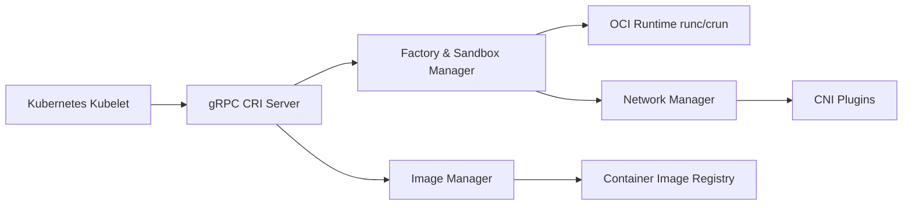

# cri-o/cri-o

> Runtime de conteneurs léger qui implémente l'interface CRI de Kubernetes sur des runtimes OCI.

## Le problème
Kubelet a besoin d'un runtime conforme CRI ; Docker ou containerd apportent des fonctions hors de ce périmètre.

## Ce que ça fait vraiment
Démon `crio` exposant l'API gRPC CRI au kubelet via une socket unix.
Tire et vérifie les images (containers/image), gère les couches (containers/storage), lance via runc/crun.
Réseau par CNI, seccomp/SELinux, hooks OCI et NRI ; métriques et traces.
API HTTP de statut (`/info`, `/containers/:id`, `/config`) et `crio status`.

## Comment c'est branché


## Essayer
```bash
CGROUP_DRIVER=systemd CONTAINER_RUNTIME=remote CONTAINER_RUNTIME_ENDPOINT='unix:///var/run/crio/crio.sock' ./hack/local-up-cluster.sh
sudo crio status info
```

## Coût et pièges
Gratuit ; versions mineures alignées sur Kubernetes, politique n-2. L'API HTTP n'est pas stable.

## Ce que ce n'est pas
Pas un outil pour construire ou pousser des images, ni une CLI utilisateur : passer par crictl ou Podman.

## Alternatives
Aucune alternative nommée dans le README (crictl et Podman sont des clients).

## Pour toi
À ignorer : choix d'équipe plateforme Kubernetes, invisible pour qui déploie des modèles sur un cluster existant.
