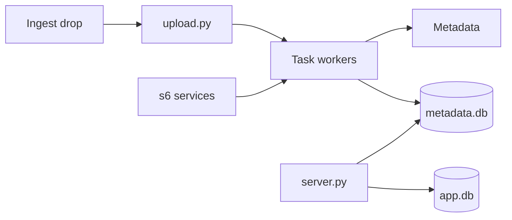

# crocodilestick/Calibre-Web-Automated

> Bibliothèque numérique auto-hébergée combinant l'interface Calibre-Web et les automatisations de Calibre.

## Le problème
Calibre conteneurisé est lourd et peu utilisable sur mobile, Calibre-Web manque de fonctions : on finit par faire tourner les deux.

## Ce que ça fait vraiment
Dossier d'ingestion surveillé : import automatique de 28 formats, conversion (EPUB, MOBI, AZW3, KEPUB, PDF), réparation EPUB.
Métadonnées récupérées à l'import et réécrites dans les fichiers ; sauvegarde des originaux, doublons, étagères dynamiques.
Envoi automatique vers liseuse, synchro KOReader et Kobo, OAuth/OIDC, statistiques.
Services supervisés par s6 dans un seul conteneur ; mode spécial pour partages réseau (NFS/SMB).

## Comment c'est branché


## Essayer
```bash
curl -OL https://raw.githubusercontent.com/crocodilestick/calibre-web-automated/main/docker-compose.yml
docker compose up -d
```

## Coût et pièges
Gratuit ; identifiants admin par défaut (admin/admin123) à changer. Les fichiers du dossier d'ingestion sont supprimés après traitement.
Licence GPL-3.0.

## Ce que ce n'est pas
Pas un outil data ou IA.
Pas multi-bibliothèques : une seule bibliothèque par instance.

## Alternatives
- Calibre-Web : version de base, plus légère.
- Calibre : version complète, lourde en conteneur.

## Pour toi
À ignorer pour ta veille pro : excellent projet de homelab pour les livres, sans lien avec la data ou le MLOps.
