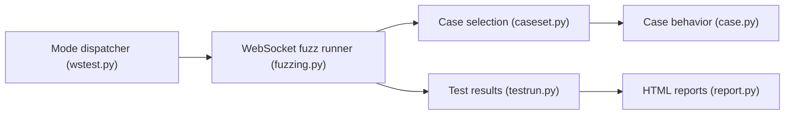

# crossbario/autobahn-testsuite

> Suite de conformité WebSocket qui teste clients et serveurs, pour les implémenteurs du protocole.

## Le problème
Vérifier qu'une implémentation WebSocket respecte la spécification et résiste aux cas limites.

## Ce que ça fait vraiment
- Plus de 500 cas : trames, ping/pong, fragmentation, UTF-8, fermeture, compression permessage-deflate.
- Mode « fuzzingserver » pour tester des clients, « fuzzingclient » pour des serveurs ; rapports HTML.
- Outils annexes : serveurs echo et broadcast, WAMP, mass-connect, wsperf.
- L'image Docker est volontairement figée sur PyPy 2.7 ; le paquet Python ne fonctionne qu'en Python 2.

## Comment c'est branché


## Essayer
```bash
docker run -it --rm -v "${PWD}/config:/config" -v "${PWD}/reports:/reports" -p 9001:9001 --name fuzzingserver crossbario/autobahn-testsuite:25.10.1
```

## Coût et pièges
Gratuit. Environnement ancien (Python 2) volontairement gelé.

## Ce que ce n'est pas
Pas un outil de test de charge généraliste.

## Alternatives
Le README cite autobahn-python pour des clients de test en Python 3.

## Pour toi
À ignorer : utile seulement si tu écris une bibliothèque WebSocket, hors du travail data/IA courant.

