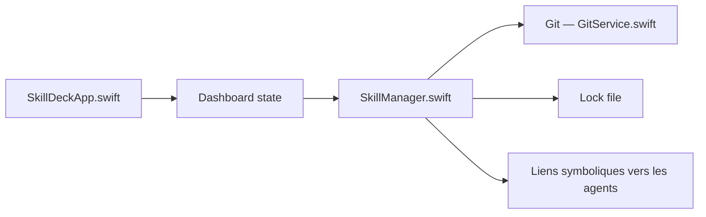

# crossoverJie/SkillDeck

> Application macOS pour gérer les skills de plusieurs agents de code depuis une seule interface.

## Le problème
Les skills d'agents (Claude Code, Codex, Gemini CLI…) vivent dans des dossiers séparés : éditions manuelles, liens symboliques et YAML à la main.

## Ce que ça fait vraiment
SkillDeck liste les skills (dossiers contenant `SKILL.md`), les installe depuis GitHub ou un dossier local, puis les assigne à des agents par liens symboliques. Il parcourt les registres (skills.sh, ClawHub), détecte les mises à jour, propose un éditeur de `SKILL.md` et surveille le système de fichiers. Le système de fichiers sert de base de données.

## Comment c'est branché


## Essayer
```bash
brew tap crossoverJie/skilldeck && brew install --cask skilldeck
xattr -cr /Applications/SkillDeck.app
swift run SkillDeck
swift test
```

## Coût et pièges
Gratuit, macOS 14+ uniquement. L'application n'est pas signée : macOS la bloque au premier lancement. La traduction en ligne exige macOS 26+.

## Ce que ce n'est pas
Pas un éditeur d'agent ni un exécuteur de skills : il gère des fichiers et des liens. Pas de version Linux ou Windows.

## Alternatives
Aucune alternative nommée dans le README.

## Pour toi
À surveiller : utile si tu jongles avec plusieurs agents sur Mac, mais projet d'une seule personne et gain limité si tu n'utilises qu'un agent.

