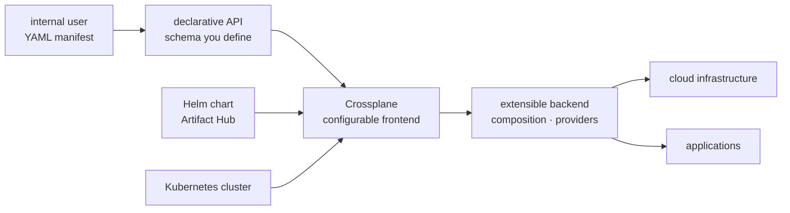

# crossplane/crossplane

> **A foundation for building a Kubernetes control plane that drives infrastructure and applications.**

## The problem

Without an in-house control plane, every team that needs a database or a bucket goes through a
Terraform repo, a ticket or a cloud console, each with its own conventions. Offering internal
users a declarative API whose schema you choose otherwise means writing your own controllers,
reconciliation logic and resource lifecycle handling.

## What it actually does

The README describes Crossplane as a framework for building cloud native control planes
**without writing code**. Two halves are claimed: an extensible backend that orchestrates
applications and infrastructure wherever they run, and a configurable frontend that puts you in
control of the schema of the declarative API it offers.

No mechanism is explained in the README itself — composition, providers and managed resources
are never described on the page; everything points to the Get Started Docs and the
"get started with composition" quickstart, outside the repo. What the README does document
precisely is the project's life: a table of maintained releases with ship and end-of-life dates
(v1.20, then v2.2 through v2.7, one per quarter), v1.20 reaching EOL when v2.5 ships in November
2026, a public roadmap kept as a GitHub project board, and fourteen special interest groups
(`sig-composition-functions`, `sig-upjet`, `sig-secret-stores`, `sig-v2-migration`…) that map the
real functional surface. The release process lives in a separate repo, `crossplane/release`.
It is a Cloud Native Computing Foundation project.

## How it is wired



No code-derived diagram exists for this repo: this one is reconstructed from the README alone,
which only uses the phrases "extensible backend", "configurable frontend" and "schema of the
declarative API". The names `composition` and `providers` come from the SIG titles and the
quickstart link, not from any architecture description.

## Trying it

```bash
# The README contains NO install or usage command at all.
# It only links out to:
#   - the Get Started Docs: https://docs.crossplane.io/latest/get-started/get-started-with-composition
#   - the Helm chart on Artifact Hub: https://artifacthub.io/packages/helm/crossplane/crossplane
#   - the releases page: https://github.com/crossplane/crossplane/releases
```

Nothing is reconstructed here: no `helm install` or `kubectl apply` line appears in the README,
and inventing one would be worse than giving none.

## Cost and gotchas

- **A Kubernetes cluster is the real prerequisite.** The README never spells it out, but
  distribution as a Helm chart and CNCF membership leave no other reading.
- **No API key and no GPU** for Crossplane itself; a control plane that provisions cloud
  resources does however need accounts and credentials at the targeted providers, and the bill
  is for the resources created, not for the tool.
- **Brisk release cadence with dated EOLs**: one release per quarter, roughly eighteen months of
  support. v1.20 dies in November 2026, and the v1 → v2 migration has its own SIG,
  `sig-v2-migration`, which says enough about how smooth it is.
- **The hidden cost is design**, not installation: deciding which API schema you expose to your
  teams is platform work, not a deployment.
- **Apache 2.0 licence**, no commercial clause; a FOSSA audit badge is shown.

## What it is not

- **Not a ready-to-use infrastructure-as-code tool** in the sense of a binary you point at a
  config file: it is a framework for *building* the control plane your teams will then use, and
  that control plane is still yours to design.
- **Not a product documented in its own repo**: the README is a governance page (releases,
  roadmap, SIGs, channels). All the learning happens on `docs.crossplane.io`, away from the code.
- **Not an MLOps platform**: nothing in the README touches models, data or training. The link to
  AI work is indirect, through the platform that hosts the workloads.

## Alternatives

| | When to prefer it |
|---|---|
| **karmada-io/karmada** | The only comparable neighbour in the catalogue: also a Kubernetes control plane, but aimed at spreading workloads across clusters rather than provisioning external resources behind your own API. Prefer it if the problem is "many clusters", not "expose an infrastructure API". |
| **kubernetes/minikube** | Not an alternative: a disposable local cluster, possibly the sandbox you put Crossplane on. |
| **containerd/containerd, goharbor/harbor** | Off topic here: container runtime and image registry, two floors lower in the stack. |

## For you

Watch rather than adopt if you are a data / AI / MLOps profile: Crossplane is platform
engineering, and it pays off only if you are on the side that *supplies* infrastructure to the
model teams — buckets, warehouses and GPU clusters provisioned behind an in-house API. If you
consume the platform instead of building it, walk on; and in any case this repo will teach you
nothing, since all the substance lives on the documentation site.
