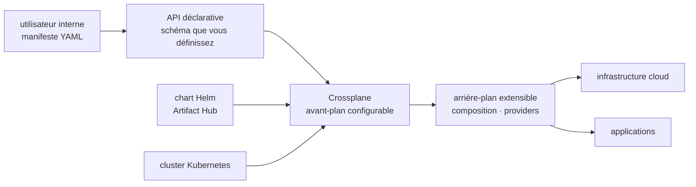

# crossplane/crossplane

> **Socle pour bâtir un plan de contrôle Kubernetes qui pilote infrastructure et applications.**

## Le problème

Sans plan de contrôle maison, chaque équipe qui veut une base de données ou un bucket passe
par un dépôt Terraform, un ticket ou une console cloud, avec ses conventions propres. Exposer
à ses utilisateurs internes une API déclarative dont on choisit le schéma suppose sinon
d'écrire soi-même contrôleurs, réconciliation et cycle de vie des ressources.

## Ce que ça fait vraiment

Crossplane est décrit dans son README comme un cadre pour construire des plans de contrôle
« cloud native » **sans écrire de code**. Deux moitiés annoncées : un arrière-plan extensible,
qui orchestre applications et infrastructure quel que soit l'endroit où elles tournent, et un
avant-plan configurable, où c'est vous qui fixez le schéma de l'API déclarative offerte.

Le README ne détaille aucun mécanisme : ni composition, ni providers, ni ressources gérées ne
sont expliqués sur place — tout renvoie aux *Get Started Docs* et au quickstart « get started
with composition », hors dépôt. Ce qu'il documente en revanche précisément, c'est la vie du
projet : un tableau de versions maintenues avec dates de sortie et de fin de vie (v1.20, puis
v2.2 à v2.7, cadence trimestrielle), la fin de vie de la v1.20 à la sortie de la v2.5 en
novembre 2026, une feuille de route publique tenue en tableau de projet GitHub, et quatorze
groupes d'intérêt (`sig-composition-functions`, `sig-upjet`, `sig-secret-stores`,
`sig-v2-migration`…) qui découpent la surface fonctionnelle réelle. Le processus de publication
vit dans un dépôt séparé, `crossplane/release`. Projet de la Cloud Native Computing Foundation.

## Comment c'est branché



Aucun diagramme tiré du code n'existe pour ce dépôt : ce schéma est reconstruit depuis le seul
README, qui n'emploie que les termes « arrière-plan extensible », « avant-plan configurable » et
« schéma de l'API déclarative ». Les noms `composition` et `providers` viennent des intitulés de
groupes d'intérêt et du lien de quickstart, pas d'une description d'architecture.

## Essayer

```bash
# Le README ne contient AUCUNE commande d'installation ni d'utilisation.
# Il renvoie uniquement, par lien, à :
#   - les « Get Started Docs » : https://docs.crossplane.io/latest/get-started/get-started-with-composition
#   - le chart Helm publié sur Artifact Hub : https://artifacthub.io/packages/helm/crossplane/crossplane
#   - la page des releases : https://github.com/crossplane/crossplane/releases
```

Rien n'est reconstruit ici : aucune ligne `helm install` ni `kubectl apply` n'apparaît dans le
README, et en inventer une serait pire que de n'en donner aucune.

## Coût et pièges

- **Un cluster Kubernetes est le vrai prérequis.** Le README ne l'écrit pas noir sur blanc, mais
  la distribution par chart Helm et l'appartenance au paysage CNCF ne laissent pas d'autre lecture.
- **Pas de clé d'API ni de GPU** pour Crossplane lui-même ; en revanche un plan de contrôle qui
  provisionne du cloud suppose des comptes et des identifiants chez les fournisseurs visés, et la
  facture est celle des ressources créées, pas de l'outil.
- **Rythme de versions soutenu et fins de vie datées** : une version par trimestre, support de
  l'ordre de dix-huit mois. La v1.20 meurt en novembre 2026 ; la migration v1 → v2 a son propre
  groupe d'intérêt, `sig-v2-migration`, ce qui dit assez qu'elle n'est pas anodine.
- **Le coût caché est la conception**, pas l'installation : définir le schéma d'API qu'on expose
  à ses équipes est un travail de plateforme, pas un déploiement.
- **Licence Apache 2.0**, sans clause commerciale ; audit FOSSA affiché.

## Ce que ce n'est pas

- **Ce n'est pas un outil d'infrastructure-as-code prêt à l'emploi** au sens d'un binaire qu'on
  lance sur un fichier de configuration : c'est un cadre pour *construire* le plan de contrôle
  que vos équipes utiliseront ensuite, et ce plan de contrôle reste à concevoir.
- **Ce n'est pas un produit documenté dans son dépôt** : le README est une page de gouvernance
  (versions, feuille de route, groupes d'intérêt, canaux). Tout l'apprentissage se fait sur
  `docs.crossplane.io`, hors du code.
- **Ce n'est pas une plateforme MLOps** : rien dans le README ne touche aux modèles, aux données
  ou à l'entraînement. Le lien avec l'IA est indirect, par la plateforme qui héberge les charges.

## Alternatives

| | Quand le préférer |
|---|---|
| **karmada-io/karmada** | Seul voisin comparable du catalogue : lui aussi un plan de contrôle Kubernetes, mais orienté distribution de charges sur plusieurs clusters plutôt que provisionnement de ressources externes par API maison. À préférer si le problème est « plusieurs clusters », pas « exposer une API d'infrastructure ». |
| **kubernetes/minikube** | Pas une alternative : cluster local jetable, éventuellement le terrain d'essai sur lequel poser Crossplane. |
| **containerd/containerd, goharbor/harbor** | Hors sujet ici : exécution de conteneurs et registre d'images, deux étages plus bas dans la pile. |

## Pour toi

À surveiller plutôt qu'à adopter pour un profil data / IA / MLOps : Crossplane est un outil
d'ingénierie de plateforme, et il ne paie que si vous êtes du côté qui *fournit* l'infrastructure
aux équipes modèles — provisionner buckets, entrepôts et clusters GPU derrière une API maison.
Si vous consommez la plateforme au lieu de la construire, passez votre chemin ; et de toute
façon, ce dépôt ne vous apprendra rien, la matière est entièrement sur le site de documentation.
