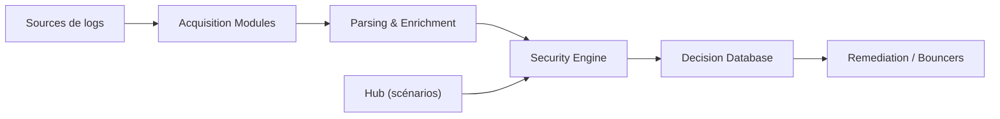

# crowdsecurity/crowdsec

> Moteur de sécurité open source qui détecte les comportements malveillants dans les logs et bloque les IP.

## Le problème
Repérer des attaques (force brute, scan de ports, scan web) dans les journaux de serveurs et bloquer les sources, sans maintenir soi-même des règles.

## Ce que ça fait vraiment
Le moteur lit des journaux de sources variées (fichiers, syslog, docker, journald, Kafka, CloudWatch…), les analyse et enrichit, applique des scénarios de détection puis produit des décisions stockées en base. Des composants de remédiation (bouncers) appliquent le blocage à d'autres niveaux (pare-feu, HTTP). Scénarios et règles se récupèrent sur le Hub ; le principe est « détecter ici, remédier ailleurs ». Il fait aussi office de WAF.

## Comment c'est branché

## Essayer
Aucune commande documentée dans le README, qui renvoie à la documentation pour installer sur Linux, Windows, Docker, OpnSense ou Kubernetes.

## Coût et pièges
Le moteur est gratuit. Les listes de blocage communautaires reposent sur le partage de signaux avec le réseau (le README dit que les utilisateurs partagent les menaces rencontrées). Console, listes supplémentaires et fonctions premium relèvent d'un service à part.

## Ce que ce n'est pas
Ce n'est pas un antivirus ni un outil d'analyse de données : il ne protège que ce qui passe par des logs analysés et des bouncers déployés.

## Alternatives
Le README ne nomme aucune alternative.

## Pour toi
Surveiller : utile pour protéger un serveur exposé qui héberge une API ou un modèle, mais c'est de l'exploitation sécurité, avec un partage de données à accepter en connaissance de cause.

