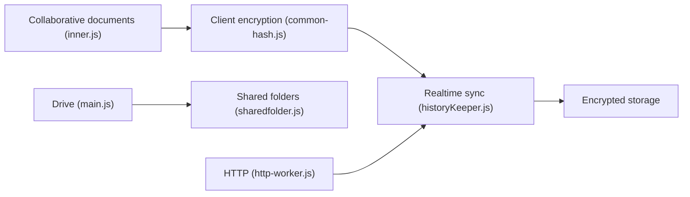

# cryptpad/cryptpad

> Suite collaborative open source chiffrée de bout en bout, à héberger soi-même.

## Le problème
Les outils de collaboration en ligne voient le contenu en clair ; une fuite du serveur expose tout.

## Ce que ça fait vraiment
Le navigateur chiffre les documents avant envoi, synchronise en temps réel et le serveur stocke des données chiffrées. Comptes dérivés de clés cryptographiques, drive, dossiers partagés, administration. Le code (historyKeeper, http-worker) assure sync et stockage. Le README précise que le code de chiffrement est servi par l'instance : il faut faire confiance à l'administrateur.

## Comment c'est branché

## Essayer
Le README renvoie aux guides développeur et administrateur, et indique un `Dockerfile` et `docker-compose.yml` à la racine ; aucune commande n'y figure.

## Coût et pièges
Gratuit auto-hébergé ; production exige HTTPS et configuration avancée. AGPL-3.0. 373 issues ouvertes.

## Ce que ce n'est pas
Pas protégé contre un serveur malveillant qui altère le code servi (« attaque active »). Ne cache pas les adresses IP.

## Alternatives
Aucune nommée dans le README.

## Pour toi
À surveiller : pertinent pour un espace collaboratif confidentiel auto-hébergé ; hors cœur data/IA.

