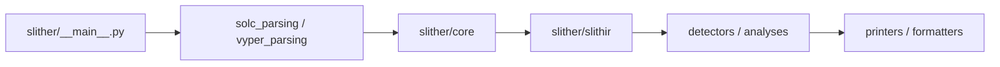

# crytic/slither

> Analyseur statique Python pour contrats Solidity et Vyper, pour développeurs et auditeurs de smart contracts.

## Le problème
Les failles de smart contracts (réentrance, delegatecall) coûtent cher une fois déployées.

## Ce que ça fait vraiment
Compile le contrat via solc ou un framework (Hardhat, Foundry), construit un modèle et une représentation intermédiaire SlithIR, puis lance une centaine de détecteurs classés par impact et confiance. Fournit des « printers » (graphe d'appels, héritage, CFG), des outils (check-upgradeability, flat, read-storage) et une API pour écrire ses détecteurs. Sortie Markdown/SARIF pour la CI.

## Comment c'est branché


## Essayer
```bash
uv tool install slither-analyzer
python3 -m pip install slither-analyzer
slither .
slither tests/uninitialized.sol
```

## Coût et pièges
Gratuit. Python 3.10+, et solc ; les projets avec dépendances doivent se compiler (`slither .`). Licence AGPL-3.0 (copyleft fort).

## Ce que ce n'est pas
Pas une preuve de sécurité : l'analyse statique donne des faux positifs et des faux négatifs ; il ne remplace pas un audit.

## Alternatives
Aucune nommée dans le README.

## Pour toi
À surveiller : seulement si ton travail touche des contrats Solidity ; hors de ce cas, hors sujet.

