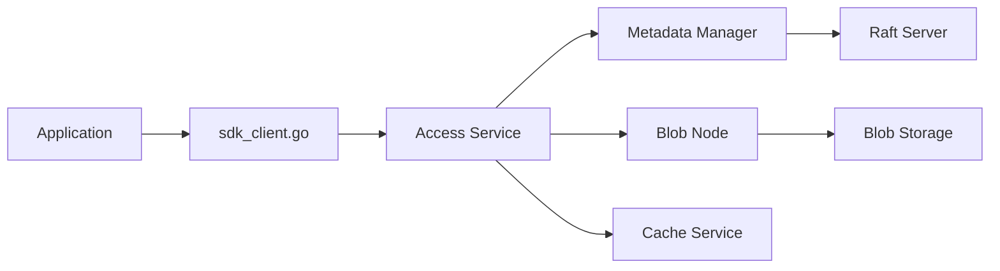

# cubefs/cubefs

> Système de stockage distribué fichiers et objets, projet CNCF gradué, pour datacenters et data lakes.

## Le problème
Séparer calcul et stockage pour bases, recherche ou IA exige un stockage partagé scalable, multi-protocole et multi-tenant.

## Ce que ça fait vraiment
Accès POSIX, HDFS, S3 et API REST.
Métadonnées distribuées à cohérence forte (Raft) ; réplication ou erasure coding au choix.
Optimisations petits/gros fichiers et écritures séquentielles/aléatoires ; cache multi-niveaux au-dessus de S3.
Planificateurs de réparation, migration et rééquilibrage.

## Comment c'est branché

## Essayer
Aucune commande dans le README : il renvoie à la documentation en ligne.

## Coût et pièges
Gratuit ; cluster multi-nœuds à opérer. La branche master peut être cassée : utiliser les releases.

## Ce que ce n'est pas
Pas un stockage à monter en cinq minutes sur un portable. README d'accueil sans guide de démarrage.

## Alternatives
Aucune alternative nommée dans le README.

## Pour toi
À surveiller si tu dois bâtir un data lake on-premise pour de l'entraînement : option CNCF sérieuse, mais l'exploitation relève d'une équipe infra.
