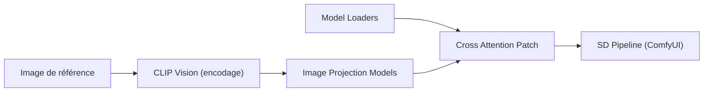

# cubiq/ComfyUI_IPAdapter_plus

> Extension ComfyUI qui applique des images de référence (sujet, style, visage) à la génération d'images.

## Le problème
Transférer le style ou le sujet d'une image sans entraîner de LoRA.

## Ce que ça fait vraiment
Nœuds ComfyUI implémentant IPAdapter (« LoRA à une image ») pour SD1.5 et SDXL : modèles basique, plus, visage, FaceID (avec insightface et LoRA), chargeur unifié aux noms de fichiers imposés, patch d'attention croisée, pondération et conditionnement régional. Nécessite des encodeurs CLIP Vision et des modèles à télécharger à part.

## Comment c'est branché

## Essayer
Aucune commande documentée : cloner le dépôt dans `ComfyUI/custom_nodes/` ou passer par le Manager, puis placer les modèles dans `models/clip_vision`, `models/ipadapter` et `models/loras`.

## Coût et pièges
GPU nécessaire pour générer. Noms de fichiers à respecter exactement pour le chargeur unifié. Depuis avril 2025 : mode « maintenance uniquement » annoncé par l'auteur.

## Ce que ce n'est pas
Pas un outil autonome : il exige ComfyUI à jour. Licence GPL-3.0.

## Alternatives
Aucune nommée dans le README.

## Pour toi
À surveiller si tu fais de l'image générative sous ComfyUI ; sinon à laisser, projet en fin de vie.

