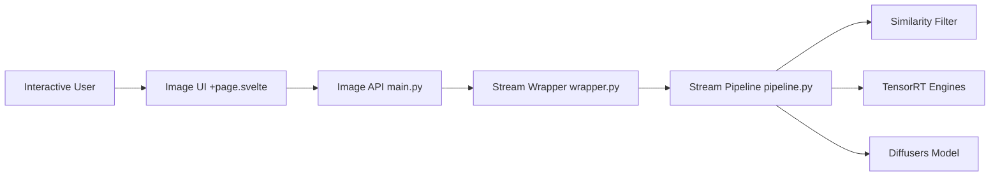

# cumulo-autumn/StreamDiffusion

> Pipeline de diffusion temps réel pour génération d'images interactive (txt2img, img2img, webcam).

## Le problème
Les pipelines Stable Diffusion standards sont trop lents pour de l'interactif (flux webcam, génération en direct).

## Ce que ça fait vraiment
Enveloppe un `StableDiffusionPipeline` Diffusers : Stream Batch, Residual CFG, filtre de similarité stochastique, files d'E/S.
Fusion LCM-LoRA, VAE tiny, accélération xformers ou TensorRT (construction de moteurs).
Mesures annoncées : ~106 fps txt2img avec SD-turbo sur RTX 4090.
Démos web temps réel txt2img et img2img (webcam, capture d'écran).

## Comment c'est branché


## Essayer
```bash
git clone https://github.com/cumulo-autumn/StreamDiffusion.git
conda create -n streamdiffusion python=3.10
conda activate streamdiffusion
pip3 install torch==2.1.0 torchvision==0.16.0 xformers --index-url https://download.pytorch.org/whl/cu121
pip install streamdiffusion[tensorrt]
python -m streamdiffusion.tools.install-tensorrt
```

## Coût et pièges
GPU NVIDIA indispensable, versions figées (torch 2.1.0). Dernier push en décembre 2024 : dépendances vieillissantes.

## Ce que ce n'est pas
Pas un modèle : un pipeline d'accélération autour de modèles SD existants. Pas maintenu activement.

## Alternatives
Aucune nommée dans le README.

## Pour toi
À ignorer : techniques intéressantes (RCFG, filtre de similarité) à lire dans le papier, mais code figé depuis fin 2024 sur une pile PyTorch datée.
