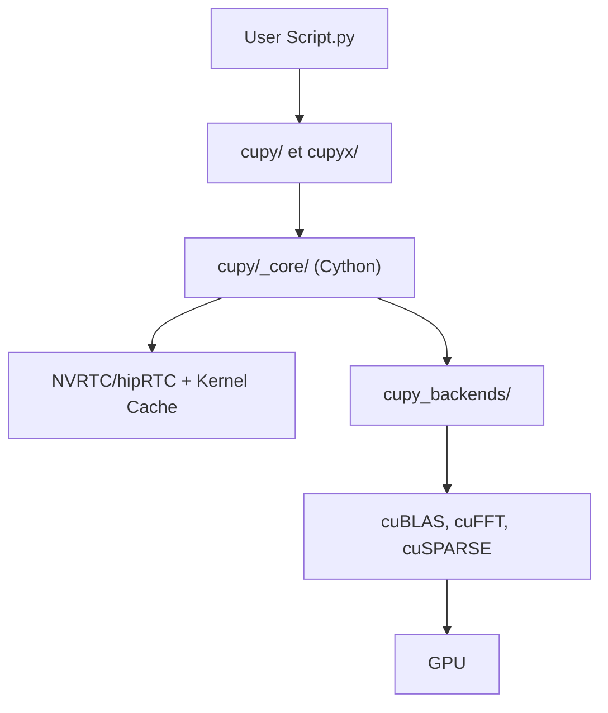

# cupy/cupy

> Bibliothèque de tableaux compatible NumPy/SciPy qui s'exécute sur GPU NVIDIA ou AMD.

## Le problème
Le code numérique NumPy/SciPy tourne sur CPU et devient lent sur de gros tableaux.

## Ce que ça fait vraiment
Reprend l'API de NumPy et SciPy sur CUDA ou ROCm. Donne aussi accès au bas niveau : RawKernels, streams, appels au runtime CUDA. D'après le code, une couche de backends (CUDA, ROCm, stub) s'appuie sur cuBLAS, cuFFT, etc., avec compilation à la volée NVRTC et cache de noyaux.

## Comment c'est branché


## Essayer
```bash
pip install cupy-cuda12x
conda install -c conda-forge cupy
docker run --gpus all -it cupy/cupy
```

## Coût et pièges
GPU NVIDIA (CUDA 12.x/13.x) ou AMD (ROCm 7.0, marqué expérimental) indispensable. Choisir le bon paquet pip selon la version CUDA.

## Ce que ce n'est pas
Pas un remplaçant automatique sans GPU, et pas un framework d'apprentissage profond. 691 issues ouvertes.

## Alternatives
Aucune alternative nommée dans le README.

## Pour toi
Adopter si tu as un GPU et du code NumPy à accélérer : changement minimal, d'après le README.

