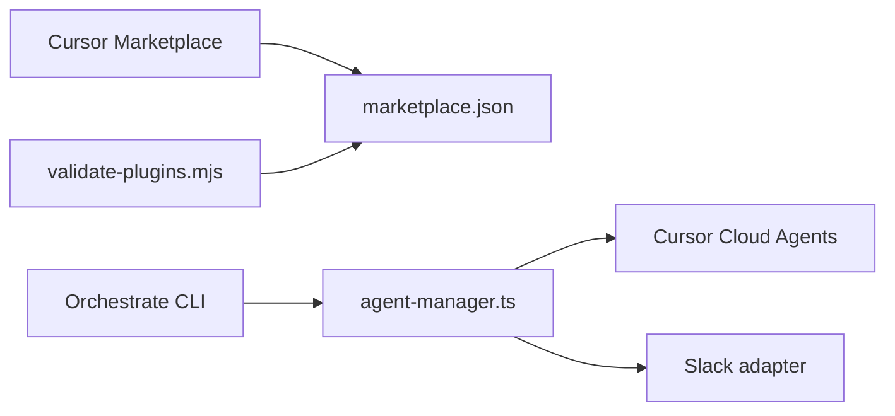

# cursor/plugins

> Catalogue de plugins officiels Cursor : skills, règles et serveurs MCP vers des dizaines de SaaS.

## Le problème
Brancher un agent de code sur Gmail, GitHub, BigQuery, Salesforce… demande du câblage MCP répété.

## Ce que ça fait vraiment
Chaque plugin est un dossier avec son manifeste `.cursor-plugin/plugin.json` (skills, règles, mcp.json). Un validateur (`scripts/validate-plugins.mjs`) contrôle le catalogue. Le plus fourni est `orchestrate` : CLI Bun qui crée des agents cloud Cursor en planificateur/worker/vérificateur, avec Slack en option. Autres : continual-learning (mise à jour d'AGENTS.md), pstack, pr-review-canvas.

## Comment c'est branché


## Essayer
```bash
# Aucune commande documentée : installation via le Marketplace Cursor
```

## Coût et pièges
Suppose Cursor ; les plugins d'intégration exigent les comptes des SaaS ciblés. Aucune licence déclarée dans le catalogue.

## Ce que ce n'est pas
Pas une bibliothèque autonome : ne sert qu'avec Cursor. Beaucoup de plugins listés n'ont pas leur code dans le dépôt.

## Alternatives
Aucune alternative nommée dans le README.

## Pour toi
Surveiller : `orchestrate` et `continual-learning` donnent des patrons agentiques à étudier, mais tout dépend de Cursor et d'une licence absente.

